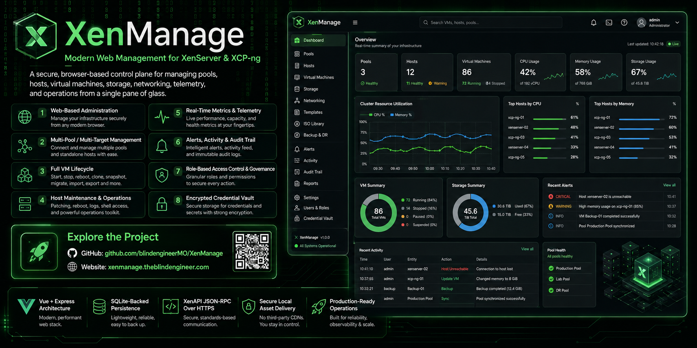

# XenMange



A self-hosted, governance-first web console for administering XenServer/XCP-ng pools, hosts, VMs, storage, and networking. Vue 3 SPA + Express API talking to XenServer's JSON-RPC v2.0 XAPI, with a CSP-safe local runtime, a SQLite-backed control plane, and automated unit + browser test coverage.

## Why XenMange Exists

Most XenServer tooling (XenCenter, the raw `xe` CLI) assumes a single trusted operator with root credentials talking straight to a host. That model breaks down the moment more than one person touches the infrastructure: there's no record of who did what, nothing stops someone from fat-fingering a delete on a production VM, there's no shared view of which pool is about to run out of memory, and there's no durable answer to "what's the recovery plan for this workload?" XenMange puts a governed control plane in front of XenServer without giving up direct XAPI access underneath it:

- **Governance & compliance** exist because destructive hypervisor operations — VM delete, snapshot revert, host reboot/shutdown, credential rotation — are effectively irreversible, and "I have root, so I can" is not an audit trail. XenMange enforces role ceilings (`read-only` / `operator` / `admin`), per-pool and aggregate vFabric resource quotas, and an approval-request/decision workflow so that a destructive action either requires a sufficiently privileged role or a recorded, scoped approval — and every action lands in a searchable, exportable log.
- **Disaster Recovery / Resilience tooling** exists because "we have snapshots somewhere" is not a recovery plan. XenMange derives a protection posture per workload — recovery tier, HA restart priority, backup freshness — from VM tags and XenServer's own task/message history, then lets operators author and drill actual recovery runbooks against that posture. Failover readiness becomes something you can see and rehearse instead of something you assume.
- **Capacity / balancing tooling** exists because host memory pressure and storage over-commitment creep up silently between the moments someone happens to open a monitoring dashboard. XenMange persists telemetry history and continuously surfaces skew, saturation, and headroom so a hot host or an over-committed SR gets caught before it becomes an incident.

None of this replaces XenServer's own mechanisms — HA, live migration, snapshots, XAPI itself. XenMange orchestrates them and adds accountability and visibility around them. See [Governance & Compliance](#governance--compliance) and [Disaster Recovery & Resilience](#disaster-recovery--resilience) below for exactly what is and isn't automated today.

## Quick Start

### Local (Node.js)

```bash
npm install
cp .env.example .env
npm run dev
```

Open [http://localhost:3000](http://localhost:3000) and sign in with `admin` / the `XENMANGE_BOOTSTRAP_PASSWORD` value from your `.env`.

### Docker

```bash
cp .env.example .env
# at minimum, set SESSION_SECRET and XENMANGE_BOOTSTRAP_PASSWORD in .env
# (VAULT_ENCRYPTION_KEY is recommended for production — see Configuration below)
docker compose up -d --build
```

This builds the Vue client bundle into the image and runs the server as a non-root user against a named `xenmange-data` volume, so the four SQLite databases survive container rebuilds/restarts. See `Dockerfile` and `docker-compose.yml` in the repo root.

## How XenMange Is Organized

Signing in to XenMange is a login to the **application**, not to a XenServer host. Local credentials (the bootstrap `admin` account, or any user created under Governance → Users) authenticate against `security.db`. XenServer pools and standalone hosts are registered *afterward*, as saved **targets**:

- **Pools workspace → Registered Pool Targets** — saved pool connections (host, username, optional vault credential).
- **Hosts workspace → Registered Host Targets** — saved standalone-host connections, independent of any pool membership.
- **vFabrics workspace** — XenMange-only logical groupings that can contain any combination of registered pools and standalone hosts without changing the underlying XenServer topology.

A target can be bound to a credential stored in the encrypted vault (`vault.db`) instead of a plaintext password, and an authenticated control-plane session can attach, switch between, and detach **multiple live Xen targets at once** without ever logging out of XenMange itself. A legacy "Direct Xen Login" path exists for connecting straight to a host at sign-in time, but the intended flow — and the one the app defaults to — is control-plane login first, targets second.

## Usage Guide

1. **Sign in** to the XenMange control plane.
2. **Register a target** from Pools or Hosts — host/username/password, or a saved vault credential — then attach it to bring it live.
3. **Inventory** gives you a searchable cross-object view (VMs, hosts, SRs, networks, saved targets) plus server-persisted workspace presets, so repeat navigation doesn't mean rebuilding the same filtered view every session.
4. **VMs** — power operations, snapshots/checkpoints, fast clone / full copy, same-pool and cross-pool/storage-remapped live migration, a compatibility matrix (`VM.get_possible_hosts` + `VM.assert_can_boot_here`) for mixed-hardware placement, console access, and XVA/metadata import-export — all from the VM details workspace.
5. **Storage & Networking** — create and manage SRs (NFS, iSCSI, EXT, LVM, or probe/import an existing repository) and networks/VLANs/bonds directly from their workspaces, plus per-VDI resize/delete and per-VIF config/disconnect.
6. **Templates** — governance metadata (version label, golden-image baseline, validation posture, catalog ownership) per template, plus a compare-and-promote workflow for staged/validated generations and a deployment-validation queue.
7. **Template Library** — a floating-window file explorer (folders + JSON/YAML/shell/PowerShell/plaintext items) for authoring reusable guest-script snippets and multi-VM compose deployment specs in an in-browser Monaco editor, with save/rename/move/delete and a dry-run-then-deploy flow for compose specs straight from the editor.
8. **Lifecycle** — maintenance posture, lifecycle-oriented task tracking, heuristic compliance/drift signals, and remediation tasks backed by reusable templates.
9. **Capacity** — live and persisted trend telemetry, host skew/imbalance detection, storage commitment, and rebalancing guidance (details in [Capacity & Workload Balancing](#capacity--workload-balancing)).
10. **Resilience** — derived DR/HA readiness, recovery runbooks, and DR drill tracking (details in [Disaster Recovery & Resilience](#disaster-recovery--resilience)).
11. **Alerts** — a policy-driven triage queue fed by XenServer messages, task failures, and persisted metric thresholds, with bulk acknowledge/state changes.
12. **Activity** is the federated Log Center — audit history, auth events, alerts, remediation tasks, and XenServer task history in one searchable table, exportable as JSON, HTML, or PDF.
13. **Governance** — role, quota, and approval administration, plus local user/group management (details below).
14. **vFabrics** — saved, owner-aware operational scopes spanning registered pools and standalone hosts, with additive membership and no XenServer-side clustering changes.
15. **Settings** — runtime configuration (session timeout, trust-proxy behavior, telemetry collector controls), retention policy preview/run, and vault credential management.

## Governance & Compliance

Governance is XenMange's answer to "who is allowed to do what, and can we prove it happened." It's implemented as its own service (`server/services/governance.js`) rather than bolted onto individual routes, so the same rules apply everywhere:

- **Roles** are a strict ceiling: `read-only` (0) < `operator` (1) < `admin` (2). A session's effective role is either explicitly set or falls back to the org-wide default role from policy. Server-side checks (`hasRole`) prevent a session from escalating its own role past what its account was actually granted.
- **Policy** (`PUT /api/governance/policy`, admin-only) controls the default role, whether destructive actions require approval at all, and the approval TTL (5 minutes–7 days).
- **Quotas** are per-pool (`maxVmCount`, `maxRunningVmCount`, `maxTotalMemoryGiB`), so a team or environment can be capped without touching XenServer-side resource pools.
- **Approvals** are a scoped, single-use workflow: a request (`actionKey` + `entityType` + `entityRef` + justification) moves `pending → approved/rejected → used`, expiring automatically past its TTL. Consuming an approval re-validates that it matches the exact action/entity it was granted for — an approval to delete VM A can't be replayed against VM B. Every destructive route across VM power/snapshot/migration, host maintenance/reboot/shutdown, saved targets, retention sweeps, vault credentials, alert policies, lifecycle plans, and resilience runbooks routes through this same gate, and drops the operator straight into the approval composer when a valid token is missing instead of just failing.
- **Audit trail**: every governed action, auth event, and admin change is recorded and surfaces in the Activity → Log Center, exportable for compliance review.
- **Local users & groups** (`security.db`) give you real accounts instead of one shared admin login — active/disabled posture, per-account role ceiling, group membership, and last-admin protection (you cannot disable/demote the only remaining admin).

## Disaster Recovery & Resilience

Resilience in XenMange is a **readiness and orchestration layer**, not a black-box backup engine — worth being precise about, because "we have a resilience tab" and "we run your backups" are very different claims.

**What is derived automatically** (`server/services/resilience.js`), per VM:

- **Recovery tier** — `Tier-1` / `Edge` / `Non-Prod` / `Standard`, read from an explicit `other_config.recovery_tier` override, a runbook's declared tier, or inferred from VM tags (`prod`/`production`/`critical` → Tier-1, `edge`/`branch` → Edge, `staging`/`dev`/`test` → Non-Prod).
- **HA restart priority** — similarly resolved from an explicit override, the runbook, or the inferred tier.
- **Backup freshness** — a target backup window (12h for Tier-1, 24h otherwise, unless overridden) compared against the most recent resilience-flagged XenServer task or message matched to that VM, using pattern matching against task/message text (`snapshot|backup|protect|replicat|failover|recover|restore|drill|migrat|evacuat`) and severity keywords, to flag workloads that are overdue.

**What operators actually author and run:**

- **Recovery runbooks** — per-pool, operator-written plans (steps, recovery tier, restart priority, backup window) that the derived posture above falls back to when a VM doesn't declare its own overrides.
- **DR drills** — logged, trackable exercises against a pool's runbook, so "when did we last actually test failover for this pool" has a real answer instead of an assumption.

**What is real, executable action** (not just inference): VM snapshot/checkpoint create/revert/delete (VM Protection tab), same-pool live migration and cross-pool/storage-remapped migration with transfer-network and per-VIF remapping (VM Migration tab), and host maintenance mode with evacuation-network selection and live workload draining. These are the actual mechanisms an operator uses to protect a workload or fail it over — Resilience's job is to tell you *whether that's been done recently enough and for the right workloads*, and Capacity/Alerts tell you when a host needs evacuating in the first place.

What XenMange does **not** yet do: run its own backup/replication engine (incremental or otherwise), or automatically trigger failover. Today that stays a human-in-the-loop decision informed by the derived posture above.

## Capacity & Workload Balancing

Capacity telemetry is persisted, not just sampled live: a configurable background collector (Settings → Telemetry) polls attached targets and writes host-memory, VM-memory, and SR-utilization samples into `perf.db`, which is what powers the trend cards across Capacity, Host, and VM detail panes and the two threshold-derived alert rules (host memory ≥85%/95% warning/critical, SR utilization ≥80%/92% warning/critical — `server/services/telemetry-alerts.js`).

"Workload balancing" today means **skew detection and operator guidance, not automated placement**: for each pool, XenMange compares each host's memory usage against the pool average and surfaces the resulting deviation as an imbalance/skew percentage, alongside headroom, saturation, and per-workload risk sizing (how large a VM is relative to its current host). That analytics feed drives the Capacity workspace's rebalance guidance and can seed a Lifecycle remediation task — but XenMange does not move VMs on its own. The operator acts on that guidance using the real migration tooling in the VM Migration tab (live migration within a pool, or cross-pool/storage-remapped migration). There's no equivalent yet to an automated DRS/WLB-style engine that relocates workloads without a human triggering it.

## Architecture

```
Browser (Vue 3 SPA) ←→ Express Server (port 3000) ←→ XenServer (JSON-RPC v2.0 XAPI)
                                ↕
                  SQLite (xenmange.db / security.db / vault.db / perf.db)
```

- **Frontend**: Vue 3 runtime bundle + Vue Router 4, compiled by `scripts/build-client.js` into `client/dist` and served locally (no CDN dependency, CSP-safe).
- **Backend**: Express 5, `better-sqlite3`, Joi validation, Helmet security headers.
- **Session durability**: SQLite-backed Express sessions with live XenAPI session rehydration after process restarts, so protected routes don't drop every attached Xen target on a redeploy.
- **Four separate SQLite databases**: `xenmange.db` (connections, settings, retention policies, deployment runs), `security.db` (users, groups, durable sessions, auth events, wrapped vault key material), `vault.db` (encrypted credential ciphertext), `perf.db` (persisted telemetry history).
- **Server-rendered bootstrap**: Express renders the SPA shell with the current session's auth/connection state embedded, so the client can restore an authenticated session without an extra round-trip.
- **Theme**: dark glassmorphic "Matrix meets Hackers" — scanlines, neon green/cyan accents, floating draggable windows, dense tree navigation. New controls follow the same conventions (see `client/assets/css/components.css`): dense switches instead of checkboxes, styled dropdowns, `.dash-card` panels.

## Stack

| Layer | Technology |
|-------|-----------|
| SPA | Vue.js 3, Vue Router 4, local client bundle |
| Icons | Material Design Icons (`@mdi/font`) |
| Fonts | Share Tech Mono, Rajdhani, Exo 2 (Google Fonts) |
| Server | Express 5, Helmet, CORS, `express-session` |
| Security | CSP headers, rate limiting (20 attempts / 15 min on auth routes), Joi validation on all input |
| DB | SQLite via `better-sqlite3` — `xenmange.db` (connections, settings, retention), `security.db` (users/groups/sessions/auth events), `vault.db` (encrypted credentials), `perf.db` (telemetry history) |
| API | XenServer JSON-RPC v2.0 over HTTPS |
| Reporting | `pdfkit` for centralized log PDF exports |
| Testing | Jest (unit), Playwright (E2E) |
| Container | Docker (multi-stage `node:22-bookworm-slim` build, non-root runtime) |

## Project Structure

```
XenMange/
├── server/
│   ├── index.js                    # Express server entry
│   ├── config.js                   # Environment config
│   ├── middleware/                 # security (Helmet/CSP), session, session-store, Joi validate
│   ├── models/                     # connection.js, security-db.js, vault-db.js, perf-db.js
│   ├── routes/                     # auth, dashboard, vms, hosts, storage, networks, pools, tasks,
│   │                                #   resilience, lifecycle, alerts, audit, governance, users,
│   │                                #   groups, credentials, host-targets, workspaces, system-config,
│   │                                #   logs, metrics, template-library, api (saved connections)
│   ├── services/                   # governance, resilience(+runbooks), template-governance,
│   │                                #   remediation-tasks(+templates), lifecycle-plans, alerts,
│   │                                #   telemetry-alerts, metrics-collector, metrics-history,
│   │                                #   credential-vault, retention, log-center, audit-log,
│   │                                #   resource-ownership, system-config, template-library, xenapi
│   └── views/                      # app.ejs (SSR shell), log-export.ejs, 404.ejs, 500.ejs
├── client/
│   ├── index.html                  # Vue SPA entry
│   ├── dist/                       # Generated runtime bundle + local vendor assets
│   └── assets/
│       ├── css/                    # main.css, animations.css, components.css
│       ├── js/
│       │   ├── app.js              # Router/bootstrap entry
│       │   ├── core/                # State, view-models per domain, router, session bootstrap
│       │   ├── components/
│       │   │   ├── common/          # StatusBadge, MetricTrendCard
│       │   │   ├── controls/        # DataTable
│       │   │   ├── dialogs/         # FloatingWindow
│       │   │   ├── forms/           # ~45 domain forms (VM/host/storage/network/governance/...)
│       │   │   └── layout/          # AppShell, SideNav, StatusBar, TopNav
│       │   └── views/               # One file per route-level workspace (17 workspaces)
│       └── images/
├── tests/
│   ├── unit/server/                # Jest: routes, middleware, services
│   ├── unit/client/                # Jest: components, core view-models
│   └── e2e/                        # Playwright browser flows
├── data/                            # SQLite databases (auto-created, git-ignored)
├── Dockerfile                       # Multi-stage build → non-root runtime image
├── docker-compose.yml                # Single-service compose template
├── .env.example                      # Environment template
└── package.json
```

## API Reference

Every `/api/*` route except the two sign-in endpoints requires a valid XenMange session cookie. Two auth tiers exist:

- **Control-plane auth** (`requireAuth`) — the caller must be signed into XenMange itself (`POST /api/auth/login`). These routes manage XenMange's own data (users, saved connections, credentials, governance policy, audit log, settings) and work whether or not a XenServer pool/host is currently attached.
- **Session + attached target** (`requireXenConnection`) — the caller must be signed in **and** have a live XenServer session attached (`POST /api/auth/xen-login`, or a saved connection activated via `POST /api/auth/targets/activate`). Calling one of these routes with no target attached returns `409 XEN_TARGET_NOT_CONNECTED`.

A session can have multiple XenServer targets attached at once (multi-pool/multi-host). Every target-scoped route accepts an optional `targetKey` (body or query field) or `X-XenMange-Target-Key` header to pick which attached target the call runs against; if omitted, the session's currently-active target is used.

Many mutating routes are additionally **governance-gated** via `ensureMutationAllowed`:
- If the caller's governance role is `read-only`, the mutation is rejected with `403 READ_ONLY_MODE` — switch to `operator` or `admin` first (`PUT /api/governance/role`).
- Routes marked **destructive** also require a governance approval when the policy flag `requireDestructiveApproval` is on and the caller isn't `admin`: request one via `POST /api/governance/approvals`, have an admin approve it via `POST /api/governance/approvals/:id/decision`, then pass the returned approval's `id` as `approvalId` in the mutating request body. Admins bypass the approval requirement. See [Governance & Compliance](#governance--compliance).

All curl examples assume you've already authenticated and stored the session cookie:

```bash
curl -c cookies.txt -X POST http://localhost:3000/api/auth/login \
  -H "Content-Type: application/json" \
  -d '{"username": "admin", "password": "your-password"}'
```

For target-scoped examples below, attach a XenServer session first:

```bash
curl -b cookies.txt -c cookies.txt -X POST http://localhost:3000/api/auth/xen-login \
  -H "Content-Type: application/json" \
  -d '{"host": "xenserver.example.com", "username": "root", "password": "xen-password"}'
```

### Auth

#### `POST /api/auth/login`

- **Auth:** None (this is the sign-in endpoint). Rate-limited to 20 requests / 15 min per IP.
- **Body params:** `username` (string, required) · `password` (string, required)
- **curl:**
```bash
curl -c cookies.txt -X POST "http://localhost:3000/api/auth/login" \
  -H "Content-Type: application/json" \
  -d '{"username": "admin", "password": "your-password"}'
```

#### `POST /api/auth/xen-login`

- **Auth:** Requires an authenticated local XenMange session (`authMode: 'local'`) — returns `403 LOCAL_USER_REQUIRED` otherwise. Rate-limited to 20 requests / 15 min per IP.
- **Body params:** `host` (string, required) · `username` (string, required) · `password` (string, required unless `vaultCredentialId` is set) · `vaultCredentialId` (integer, optional — use a saved credential from `/api/credentials` instead of a raw password) · `connectionId` (integer, optional — link to a saved connection from `/api/connections`) · `connectionName` (string, optional) · `port` (integer, default `443`)
- **curl:**
```bash
curl -b cookies.txt -c cookies.txt -X POST "http://localhost:3000/api/auth/xen-login" \
  -H "Content-Type: application/json" \
  -d '{"host": "xenserver.example.com", "username": "root", "password": "xen-password", "port": 443}'
```

#### `POST /api/auth/logout`

- **Auth:** None required (safe to call on an anonymous session; destroys whatever session exists).
- **Body params:** None
- **curl:**
```bash
curl -b cookies.txt -X POST "http://localhost:3000/api/auth/logout"
```

#### `GET /api/auth/status`

- **Auth:** None required — returns `{ authenticated: false, connected: false }` for an anonymous session.
- **curl:**
```bash
curl -b cookies.txt "http://localhost:3000/api/auth/status"
```

#### `GET /api/auth/targets`

- **Auth:** Authenticated control-plane session (`requireAuth`).
- **Description:** Returns the same payload as `/api/auth/status` — the full list of currently-attached XenServer targets for this session and which one is active.
- **curl:**
```bash
curl -b cookies.txt "http://localhost:3000/api/auth/targets"
```

#### `POST /api/auth/targets/activate`

- **Auth:** Authenticated control-plane session (`requireAuth`).
- **Description:** Switches the session's active target among the ones already attached (does not create a new connection — use `POST /api/auth/xen-login` for that). Returns `404 XEN_TARGET_NOT_FOUND` if the selector doesn't match an attached target.
- **Body params:** `targetKey` (string, optional) · `connectionId` (integer, optional) — at least one should identify an already-attached target
- **curl:**
```bash
curl -b cookies.txt -X POST "http://localhost:3000/api/auth/targets/activate" \
  -H "Content-Type: application/json" \
  -d '{"connectionId": 3}'
```

#### `DELETE /api/auth/targets/:targetKey`

- **Auth:** Authenticated control-plane session (`requireAuth`).
- **Description:** Detaches (disconnects) one attached XenServer target from the session without ending the XenMange session itself. Returns `404 XEN_TARGET_NOT_FOUND` if not attached.
- **Path params:** `targetKey` (string, required, URL-encoded) — the target's key as returned by `/api/auth/status`
- **curl:**
```bash
curl -b cookies.txt -X DELETE "http://localhost:3000/api/auth/targets/host-a.example.com%3A443%3Aroot"
```


### VMs

All routes below are mounted at `/api/vms` behind `requireXenConnection`: the caller needs an authenticated control-plane session (`POST /api/auth/login`) **and** a live XenServer target attached (`POST /api/auth/xen-login` or already attached) — otherwise `401 NOT_AUTHENTICATED` or `409 XEN_TARGET_NOT_CONNECTED`. Any route may also accept an optional `targetKey` (or `targetConnectionId`) query/body field to select which attached live target to operate against when a session has more than one attached; it is omitted below for brevity. Where a route calls `ensureMutationAllowed`, a `read-only` governance role is blocked with `403 READ_ONLY_MODE`, and a `destructive: true` action additionally requires either an `admin` role or a governance `approvalId` (from a prior approved `POST /api/governance/approvals`) when the pool policy `requireDestructiveApproval` is on, else `403 APPROVAL_REQUIRED`.

#### Listing & Templates

##### `GET /api/vms/`

- **Auth:** Session + attached live target (`requireXenConnection`)
- **Query params:** `page` — integer, min 1, default `1`; `pageSize` — integer, 1-500, default `50`; `search` — string, default `''`, case-insensitive substring match against `name_label`/`name_description`; `sort` — string, default `''`; `sortDir` — `asc`\|`desc`, default `asc`
- **curl:**
```bash
curl -b cookies.txt -X GET "http://localhost:3000/api/vms/?page=1&pageSize=50&search=web"
```

##### `GET /api/vms/templates`

- **Auth:** Session + attached live target (`requireXenConnection`)
- **curl:**
```bash
curl -b cookies.txt -X GET "http://localhost:3000/api/vms/templates"
```

##### `GET /api/vms/appliances`

- **Auth:** Session + attached live target (`requireXenConnection`)
- **curl:**
```bash
curl -b cookies.txt -X GET "http://localhost:3000/api/vms/appliances"
```

##### `GET /api/vms/snapshot-schedules`

- **Auth:** Session + attached live target (`requireXenConnection`)
- **curl:**
```bash
curl -b cookies.txt -X GET "http://localhost:3000/api/vms/snapshot-schedules"
```

#### Template Governance

##### `GET /api/vms/templates/governance`

- **Auth:** Session + attached live target (`requireXenConnection`)
- **curl:**
```bash
curl -b cookies.txt -X GET "http://localhost:3000/api/vms/templates/governance"
```

##### `PUT /api/vms/templates/:ref/governance`

- **Auth:** Session + attached live target; operator/admin role required (actionKey: `template_governance_save`)
- **Path params:** `ref` — template's OpaqueRef (pattern `^OpaqueRef:`)
- **Body params:**
  - `versionLabel` — string, ≤80 chars, default `''`
  - `profileLabel` — string, ≤80 chars, default `''`
  - `lifecycleStage` — one of `draft`\|`staged`\|`stable`\|`deprecated`, default `draft`
  - `goldenImage` — boolean, default `false`
  - `guestCustomization` — string, ≤120 chars, default `''`
  - `validationStatus` — one of `untested`\|`review`\|`validated`\|`failed`, default `untested`
  - `lastValidatedAt` — ISO 8601 date string, default `''`
  - `owner` — string, ≤120 chars, default `''`
  - `notes` — string, ≤800 chars, default `''`
- **curl:**
```bash
curl -b cookies.txt -X PUT "http://localhost:3000/api/vms/templates/OpaqueRef:abcd1234-ef56-7890-abcd-1234567890ab/governance" \
  -H "Content-Type: application/json" \
  -d '{"versionLabel": "2026.08-golden", "lifecycleStage": "staged", "goldenImage": true, "validationStatus": "review", "owner": "platform-team"}'
```

##### `GET /api/vms/templates/:ref/history`

- **Auth:** Session + attached live target (`requireXenConnection`)
- **Path params:** `ref` — template's OpaqueRef
- **curl:**
```bash
curl -b cookies.txt -X GET "http://localhost:3000/api/vms/templates/OpaqueRef:abcd1234-ef56-7890-abcd-1234567890ab/history"
```

##### `POST /api/vms/templates/:ref/history/:id/restore`

- **Auth:** Session + attached live target; operator/admin role required (actionKey: `template_governance_restore`)
- **Path params:** `ref` — template's OpaqueRef; `id` — history entry id (string, 1-160 chars)
- **curl:**
```bash
curl -b cookies.txt -X POST "http://localhost:3000/api/vms/templates/OpaqueRef:abcd1234-ef56-7890-abcd-1234567890ab/history/hist-20260810-0931/restore" \
  -H "Content-Type: application/json"
```

##### `POST /api/vms/templates/:ref/promote`

- **Auth:** Session + attached live target; operator/admin role required (actionKey: `template_promote`)
- **Path params:** `ref` — template's OpaqueRef
- **Body params:**
  - `baselineTemplateRef` — OpaqueRef string, optional, default `''` — an existing stable baseline to retire in favor of this one
  - `retireExistingStable` — boolean, default `true` — retires other `stable` versions of this template lineage
  - `promotionNotes` — string, ≤800 chars, default `''`
- **curl:**
```bash
curl -b cookies.txt -X POST "http://localhost:3000/api/vms/templates/OpaqueRef:abcd1234-ef56-7890-abcd-1234567890ab/promote" \
  -H "Content-Type: application/json" \
  -d '{"retireExistingStable": true, "promotionNotes": "Passed boot, network, and storage validation."}'
```

#### Template Deployment

##### `GET /api/vms/templates/deployments`

- **Auth:** Session + attached live target (`requireXenConnection`)
- **curl:**
```bash
curl -b cookies.txt -X GET "http://localhost:3000/api/vms/templates/deployments"
```

##### `PUT /api/vms/templates/deployments/:id/validation`

- **Auth:** Session + attached live target; operator/admin role required (actionKey: `template_deployment_validate`)
- **Path params:** `id` — deployment audit record id (not pattern-validated)
- **Body params:**
  - `validationStatus` — one of `pending`\|`validated`\|`warning`\|`failed`, default `pending`
  - `validationNotes` — string, ≤800 chars, default `''`
  - `guestCustomization` — string, ≤120 chars, default `''`
  - `bootVerified` — boolean, default `false`
  - `networkVerified` — boolean, default `false`
  - `storageVerified` — boolean, default `false`
  - `policyTagged` — boolean, default `false`
- **curl:**
```bash
curl -b cookies.txt -X PUT "http://localhost:3000/api/vms/templates/deployments/dep-20260810-0001/validation" \
  -H "Content-Type: application/json" \
  -d '{"validationStatus": "validated", "bootVerified": true, "networkVerified": true, "storageVerified": true, "policyTagged": true}'
```

##### `POST /api/vms/templates/:ref/deploy`

- **Auth:** Session + attached live target; operator/admin role required (actionKey: `template_deploy`). When `hostRef` is supplied, the request is checked against the destination pool's configured governance quota (`409 QUOTA_EXCEEDED`) and every enabled vFabric containing the active target (`409 VFABRIC_QUOTA_EXCEEDED` or `409 VFABRIC_QUOTA_SCOPE_INCOMPLETE`). Aggregate vFabric enforcement requires every saved member target to be attached, avoiding a decision based on partial usage.
- **Path params:** `ref` — source template's OpaqueRef (not pattern-validated by this route)
- **Body params:**
  - `nameLabel` — string, required, 1-120 chars
  - `nameDescription` — string, ≤500 chars, default `''`
  - `hostRef` — OpaqueRef or `null`, default `null`
  - `storageRef` — OpaqueRef or `null`, default `null`
  - `networkRef` — OpaqueRef or `null`, default `null`
  - `vcpus` — integer, required, 1-128
  - `memoryStaticMax` — integer, required, ≥1073741824 (1 GiB)
  - `tags` — array of strings (≤64 chars each), max 24 items, default `[]`
  - `startAfter` — boolean, default `false`
- **curl:**
```bash
curl -b cookies.txt -X POST "http://localhost:3000/api/vms/templates/OpaqueRef:abcd1234-ef56-7890-abcd-1234567890ab/deploy" \
  -H "Content-Type: application/json" \
  -d '{"nameLabel": "web-app-03", "hostRef": "OpaqueRef:host-1111-2222", "storageRef": "OpaqueRef:sr-3333-4444", "networkRef": "OpaqueRef:net-5555-6666", "vcpus": 4, "memoryStaticMax": 4294967296, "tags": ["web"], "startAfter": true}'
```

#### Compose Deployment

Multi-VM deployment specs authored as JSON in the [Template Library](#template-library) workspace (or posted directly). A spec deploys one or more **deployable golden templates**, resolves shared network/SR aliases, and provisions entries in `dependsOn` order in a single call.

Compose is deliberately a golden-image deployment path, not a replacement for the New VM installer. Its `template` must be a deployable template with an installed boot disk (an existing golden image or one created with **Create Golden Template**). Empty operating-system profiles are rejected here; use **New VM from Operating System** for ISO/PXE installation. Each declared `disks` entry is an additional RW data disk. The source template's boot disks and platform metadata are retained. `networkInterfaces` replaces inherited template VIFs, and XenServer assigns supported VIF device slots automatically.

### Bundled Diskless OS Profiles

**New VM from Operating System** includes a XenMange-managed catalogue of diskless installation profiles. Operators do not need to create a separate empty template for common guests: Windows Server 2003, 2008 R2, 2012 R2, 2016, 2019, 2022, and 2025; Windows 10 and 11; Ubuntu Server 22.04/24.04; Debian 12; Rocky Linux 9; RHEL 9; SLES 15; and generic Linux/install-media profiles are included.

The catalogue resolves each choice against the connected pool's real empty XenServer templates. It prefers a pool-provided matching profile and otherwise uses the stock `Other install media` diskless template, then applies the profile's practical firmware, CPU, memory, and root-disk defaults in the wizard. This remains a supported `VM.copy`/`VM.provision` flow; XenMange never uses deprecated `VM.create` to manufacture templates. If a pool has neither a matching empty profile nor `Other install media`, the bundled options are intentionally unavailable until the host's standard XenServer templates are restored.

##### `POST /api/vms/compose/dry-run`

- **Auth:** Session + attached live target (`requireXenConnection`) — read-only, no governance mutation gate.
- **Description:** Validates and resolves a compose spec (templates, networks, SRs, dependency order) without creating anything, returning the resolved plan.
- **Body params:** see `composeDeploy` schema under `POST /api/vms/compose/deploy` below.
- **curl:**
```bash
curl -b cookies.txt -X POST "http://localhost:3000/api/vms/compose/dry-run" \
  -H "Content-Type: application/json" \
  -d '{"name":"web-tier","vms":{"web-01":{"template":"ubuntu-24-golden","nameLabel":"web-01","memoryStaticMax":4294967296}}}'
```

##### `POST /api/vms/compose/deploy`

- **Auth:** Session + attached live target; operator/admin role required (actionKey: `compose_deploy`).
- **Description:** Executes a compose spec, creating (and optionally starting) each declared VM in dependency order. Returns `201` when every VM deployed cleanly, or `207` with per-VM failure detail if any VM in the spec failed.
- **Body params:**
  - `version` — string, must be `"1"`, default `"1"`
  - `name` — string, required, 1-120 chars
  - `variables` — object of string→(string\|number\|boolean), default `{}` — substitution values referenced elsewhere in the spec
  - `networks` — object mapping a spec-local alias to `{ ref }` (network `OpaqueRef`), default `{}`
  - `storageRepositories` — object mapping a spec-local alias to `{ ref }` (SR `OpaqueRef`), default `{}`
  - `targetKey` — string, optional, max 200 — which attached live target to deploy against
  - `startAfter` — boolean, default `true`
  - `vms` — object, required, 1-32 entries, keyed by a spec-local VM alias (1-64 chars), each value:
    - `template` — string, required, 1-200 chars — deployable golden template name, UUID, or `OpaqueRef`; operating-system profiles are rejected
    - `nameLabel` — string, required, 1-120 chars
    - `nameDescription` — string, ≤500 chars, default `''`
    - `memoryStaticMax` — number or numeric string, required
    - `memoryDynamicMin` / `memoryDynamicMax` — number or numeric string, optional; must satisfy `dynamicMin <= dynamicMax <= memoryStaticMax`
    - `vcpusAtStartup` / `vcpusMax` — number or numeric string, default `1`; `vcpusAtStartup` cannot exceed `vcpusMax`
    - `affinity` — host `OpaqueRef` or `null`, default `null`
    - `disks` — additional data disks, array (max 16) of `{ sr, sizeGb, nameLabel?, nameDescription? }`; `sr` and `sizeGb` are required. Compose does not replace or redefine golden-template boot disks.
    - `networkInterfaces` — replacement network configuration, array (max 16) of `{ network, mac? }`; `network` is required and device slots are allocated through `VM.get_allowed_VIF_devices`
    - `otherConfig` / `xenstoreData` — object of string→string, default `{}`; supplied keys merge with the cloned template metadata rather than deleting it
    - `tags` — array of strings (≤64 chars each), max 24, default `[]`
    - `dependsOn` — array of other VM aliases in this spec (max 32) — this VM deploys only after they succeed
    - `startAfter` — boolean, optional — overrides the spec-level `startAfter` for this VM
- **curl:**
```bash
curl -b cookies.txt -X POST "http://localhost:3000/api/vms/compose/deploy" \
  -H "Content-Type: application/json" \
  -d '{"name":"web-tier","startAfter":true,"vms":{"web-01":{"template":"ubuntu-24-golden","nameLabel":"web-01","memoryStaticMax":4294967296,"vcpusAtStartup":2,"vcpusMax":2,"disks":[{"sr":"Tier-1 SSD SR","sizeGb":40,"nameLabel":"web-01-data"}],"networkInterfaces":[{"network":"VMLAN Production"}]}}}'
```

#### VM Detail

##### `GET /api/vms/:ref`

- **Auth:** Session + attached live target (`requireXenConnection`)
- **Path params:** `ref` — VM's OpaqueRef
- **curl:**
```bash
curl -b cookies.txt -X GET "http://localhost:3000/api/vms/OpaqueRef:abcd1234-ef56-7890-abcd-1234567890ab"
```

#### Snapshots

##### `GET /api/vms/:ref/snapshots`

- **Auth:** Session + attached live target (`requireXenConnection`)
- **Path params:** `ref` — VM's OpaqueRef
- **curl:**
```bash
curl -b cookies.txt -X GET "http://localhost:3000/api/vms/OpaqueRef:abcd1234-ef56-7890-abcd-1234567890ab/snapshots"
```

##### `POST /api/vms/:ref/snapshots`

- **Auth:** Session + attached live target; operator/admin role required (actionKey: `vm_snapshot_create`)
- **Path params:** `ref` — VM's OpaqueRef
- **Body params:**
  - `nameLabel` — string, required, 1-120 chars
  - `nameDescription` — string, ≤500 chars, default `''`
  - `mode` — `snapshot`\|`checkpoint`, default `snapshot`
- **curl:**
```bash
curl -b cookies.txt -X POST "http://localhost:3000/api/vms/OpaqueRef:abcd1234-ef56-7890-abcd-1234567890ab/snapshots" \
  -H "Content-Type: application/json" \
  -d '{"nameLabel": "pre-patch-2026-08-25", "mode": "snapshot"}'
```

##### `POST /api/vms/:ref/snapshots/:snapshotRef/revert`

- **Auth:** Session + attached live target; operator/admin role required; destructive — needs a governance approval in operator mode (actionKey: `vm_snapshot_revert`)
- **Path params:** `ref` — VM's OpaqueRef; `snapshotRef` — snapshot VM's OpaqueRef
- **Body params:** `approvalId` — string, ≤120 chars, default `''` — required governance approval id when the pool enforces destructive approval and the caller is not `admin`
- **curl:**
```bash
curl -b cookies.txt -X POST "http://localhost:3000/api/vms/OpaqueRef:abcd1234-ef56-7890-abcd-1234567890ab/snapshots/OpaqueRef:snap-1111-2222/revert" \
  -H "Content-Type: application/json" \
  -d '{"approvalId": "appr-20260825-0007"}'
```

##### `DELETE /api/vms/:ref/snapshots/:snapshotRef`

- **Auth:** Session + attached live target; operator/admin role required; destructive — needs a governance approval in operator mode (actionKey: `vm_snapshot_delete`)
- **Path params:** `ref` — VM's OpaqueRef; `snapshotRef` — snapshot VM's OpaqueRef
- **Body params:** `approvalId` — string, ≤120 chars, default `''` — required governance approval id when the pool enforces destructive approval and the caller is not `admin`
- **curl:**
```bash
curl -b cookies.txt -X DELETE "http://localhost:3000/api/vms/OpaqueRef:abcd1234-ef56-7890-abcd-1234567890ab/snapshots/OpaqueRef:snap-1111-2222" \
  -H "Content-Type: application/json" \
  -d '{"approvalId": "appr-20260825-0007"}'
```

#### Clone / Export / Import

##### `POST /api/vms/:ref/duplicate`

- **Auth:** Session + attached live target; operator/admin role required (actionKey: `vm_duplicate_create`)
- **Path params:** `ref` — source VM's OpaqueRef
- **Body params:**
  - `nameLabel` — string, required, 1-120 chars
  - `nameDescription` — string, ≤500 chars, default `''`
  - `mode` — `clone`\|`copy`, default `clone` — `clone` is a fast, copy-on-write clone; `copy` is a full disk copy
  - `srRef` — required OpaqueRef when `mode` is `copy` (target storage repository for the full copy); otherwise an optional string, default `''`
  - `startAfter` — boolean, default `false`
- **curl:**
```bash
curl -b cookies.txt -X POST "http://localhost:3000/api/vms/OpaqueRef:abcd1234-ef56-7890-abcd-1234567890ab/duplicate" \
  -H "Content-Type: application/json" \
  -d '{"nameLabel": "web-app-03-copy", "mode": "copy", "srRef": "OpaqueRef:sr-3333-4444", "startAfter": false}'
```

##### `GET /api/vms/:ref/export`

- **Auth:** Session + attached live target (`requireXenConnection`)
- **Path params:** `ref` — VM's OpaqueRef
- **Query params:** `metadataOnly` — boolean, default `false` — export only VM metadata instead of a full XVA disk package
- **curl:**
```bash
curl -b cookies.txt -X GET "http://localhost:3000/api/vms/OpaqueRef:abcd1234-ef56-7890-abcd-1234567890ab/export?metadataOnly=false" \
  -o web-app-03.xva
```

##### `PUT /api/vms/import`

- **Auth:** Session + attached live target (`requireXenConnection`) — no governance mutation gate is applied to this route
- **Query params:** `srRef` — OpaqueRef, optional, default `''` — destination storage repository; `restore` — boolean, default `false`; `force` — boolean, default `false`; `metadataOnly` — boolean, default `false`
- **Body:** raw binary XVA package streamed as the request body (not JSON); requires either a `Content-Length` header or `Transfer-Encoding: chunked`, otherwise `400 VM_IMPORT_BODY_REQUIRED`. The optional `X-XenMange-Filename` header names the uploaded file (defaults to `package.xva`).
- **curl:**
```bash
curl -b cookies.txt -X PUT "http://localhost:3000/api/vms/import?srRef=OpaqueRef:sr-3333-4444" \
  -H "Content-Type: application/octet-stream" \
  -H "X-XenMange-Filename: web-app-03.xva" \
  --data-binary @web-app-03.xva
```

#### Migration

##### `POST /api/vms/:ref/migrate`

- **Auth:** Session + attached live target; operator/admin role required (actionKey: `vm_migrate`)
- **Path params:** `ref` — VM's OpaqueRef
- **Body params:**
  - `mode` — `same-pool`\|`cross-pool`, default `same-pool`
  - `hostRef` — OpaqueRef, default `''` — **required when `mode` is `same-pool`** (destination host within the current pool)
  - `destinationTargetKey` — string, ≤200 chars, default `''` — **required when `mode` is `cross-pool`**: the key of a different live target already attached to this session to migrate/copy the VM into
  - `transferNetworkRef` — OpaqueRef, default `''` — **required when `mode` is `cross-pool`**: network used for the inter-pool transfer
  - `srRef` — OpaqueRef, default `''` — **required when `mode` is `cross-pool`**: destination storage repository
  - `vifNetworkMap` — array of `{ vifRef, networkRef }` OpaqueRef pairs, default `[]`
  - `live` — boolean, default `true`
  - `copy` — boolean, default `false` — in `cross-pool` mode, `copy` and `live` cannot both be `true` at once
  - `force` — boolean, default `false`
  - `compress` — boolean, default `true`
  - `setAsHomeServer` — boolean, default `false` — same-pool only; updates the VM's affinity to the destination host
- **curl:**
```bash
curl -b cookies.txt -X POST "http://localhost:3000/api/vms/OpaqueRef:abcd1234-ef56-7890-abcd-1234567890ab/migrate" \
  -H "Content-Type: application/json" \
  -d '{"mode": "same-pool", "hostRef": "OpaqueRef:host-7777-8888", "live": true, "setAsHomeServer": true}'
```

##### `GET /api/vms/:ref/compatibility`

- **Auth:** Session + attached live target (`requireXenConnection`)
- **Path params:** `ref` — VM's OpaqueRef
- **curl:**
```bash
curl -b cookies.txt -X GET "http://localhost:3000/api/vms/OpaqueRef:abcd1234-ef56-7890-abcd-1234567890ab/compatibility"
```

#### Consoles

##### `GET /api/vms/:ref/consoles`

- **Auth:** Session + attached live target (`requireXenConnection`)
- **Path params:** `ref` — VM's OpaqueRef
- **curl:**
```bash
curl -b cookies.txt -X GET "http://localhost:3000/api/vms/OpaqueRef:abcd1234-ef56-7890-abcd-1234567890ab/consoles"
```

##### `GET /api/vms/:ref/consoles/:consoleRef/launch`

- **Auth:** Session + attached live target (`requireXenConnection`). Returns an HTML page (not JSON) that resolves the session-authenticated console URL and offers a direct-open link plus an embedded iframe — intended to be opened directly in a browser tab rather than called as a JSON API.
- **Path params:** `ref` — VM's OpaqueRef; `consoleRef` — console's OpaqueRef (from the `consoles` list response)
- **curl:**
```bash
curl -b cookies.txt -X GET "http://localhost:3000/api/vms/OpaqueRef:abcd1234-ef56-7890-abcd-1234567890ab/consoles/OpaqueRef:console-9999-0000/launch"
```

#### Configuration & Devices

##### `PUT /api/vms/:ref/config`

- **Auth:** Session + attached live target; operator/admin role required (actionKey: `vm_config_update`)
- **Path params:** `ref` — VM's OpaqueRef
- **Body params:**
  - `nameLabel` — string, required, 1-120 chars
  - `nameDescription` — string, ≤500 chars, default `''`
  - `userVersion` — integer, 0-2147483647, default `0`
  - `startDelay` — integer, 0-2147483647, default `0`
  - `shutdownDelay` — integer, 0-2147483647, default `0`
  - `order` — integer, 0-2147483647, default `0`
  - `vcpusAtStartup` — integer, required, 1-128
  - `vcpusMax` — integer, required, min `vcpusAtStartup`, max 128
  - `memoryStaticMax` — integer, required, ≥1073741824 (1 GiB)
  - `memoryDynamicMax` — integer, ≥1073741824, max `memoryStaticMax`, defaults to `memoryStaticMax`
  - `memoryStaticMin` — integer, required, ≥1073741824, max `memoryStaticMax`
  - `memoryDynamicMin` — integer, min `memoryStaticMin`, max `memoryDynamicMax`, defaults to `memoryDynamicMax`
  - `hardwarePlatformVersion` — integer, 0-2147483647, default `0`
  - `domainType` — one of `unspecified`\|`hvm`\|`pv`\|`pvh`\|`pv_in_pvh`, default `unspecified`
  - `hasVendorDevice` — boolean, default `true`
  - `affinity` — OpaqueRef or `''`, default `''`
  - `applianceRef` — OpaqueRef or `''`, default `''`
  - `snapshotScheduleRef` — OpaqueRef or `''`, default `''`
  - `tags` — array of strings (≤64 chars each), max 24 items, default `[]`
  - `blockedOperations` — object map of string keys (≤40 chars) to string values (≤120 chars), default `{}`
  - `vcpusParams` — object map of string keys (≤80 chars) to string values (≤255 chars), default `{}`
  - `otherConfig` — object map of string keys (≤80 chars) to string values (≤255 chars), default `{}`
  - `xenstoreData` — object map of string keys (≤120 chars) to string values (≤1024 chars), default `{}`
  - `nvram` — object map of string keys (≤160 chars) to string values (≤2048 chars), default `{}`
  - `platform` — object map of string keys (≤80 chars) to string values (≤255 chars), default `{}`
- **curl:**
```bash
curl -b cookies.txt -X PUT "http://localhost:3000/api/vms/OpaqueRef:abcd1234-ef56-7890-abcd-1234567890ab/config" \
  -H "Content-Type: application/json" \
  -d '{"nameLabel": "web-app-03", "vcpusAtStartup": 2, "vcpusMax": 4, "memoryStaticMax": 4294967296, "memoryStaticMin": 2147483648, "domainType": "hvm", "tags": ["web", "prod"]}'
```

##### `POST /api/vms/:ref/disks`

- **Auth:** Session + attached live target; operator/admin role required (actionKey: `vm_disk_add`)
- **Path params:** `ref` — VM's OpaqueRef
- **Body params:**
  - `srRef` — OpaqueRef, required — storage repository to create the disk on
  - `nameLabel` — string, required, 1-120 chars
  - `sizeBytes` — integer, required, ≥1073741824 (1 GiB)
- **curl:**
```bash
curl -b cookies.txt -X POST "http://localhost:3000/api/vms/OpaqueRef:abcd1234-ef56-7890-abcd-1234567890ab/disks" \
  -H "Content-Type: application/json" \
  -d '{"srRef": "OpaqueRef:sr-3333-4444", "nameLabel": "web-app-03-data", "sizeBytes": 10737418240}'
```

##### `POST /api/vms/:ref/nics`

- **Auth:** Session + attached live target; operator/admin role required (actionKey: `vm_nic_add`)
- **Path params:** `ref` — VM's OpaqueRef
- **Body params:**
  - `networkRef` — OpaqueRef, required — network to attach the new VIF to
  - `deviceLabel` — string, ≤12 chars, default `''` — device position/index; auto-assigned when omitted
  - `mac` — string, ≤64 chars, default `''` — auto-generated when omitted
- **curl:**
```bash
curl -b cookies.txt -X POST "http://localhost:3000/api/vms/OpaqueRef:abcd1234-ef56-7890-abcd-1234567890ab/nics" \
  -H "Content-Type: application/json" \
  -d '{"networkRef": "OpaqueRef:net-5555-6666", "deviceLabel": "1"}'
```

##### `POST /api/vms/:ref/nics/:vifRef/disconnect`

- **Auth:** Session + attached live target; operator/admin role required (actionKey: `vm_nic_disconnect`)
- **Path params:** `ref` — VM's OpaqueRef; `vifRef` — VIF's OpaqueRef
- **Body params:** `force` — boolean, default `true`
- **curl:**
```bash
curl -b cookies.txt -X POST "http://localhost:3000/api/vms/OpaqueRef:abcd1234-ef56-7890-abcd-1234567890ab/nics/OpaqueRef:vif-2222-3333/disconnect" \
  -H "Content-Type: application/json" \
  -d '{"force": true}'
```

##### `DELETE /api/vms/:ref/nics/:vifRef`

- **Auth:** Session + attached live target; operator/admin role required (actionKey: `vm_nic_remove`)
- **Path params:** `ref` — VM's OpaqueRef; `vifRef` — VIF's OpaqueRef
- **Body params:** `force` — boolean, default `true`
- **curl:**
```bash
curl -b cookies.txt -X DELETE "http://localhost:3000/api/vms/OpaqueRef:abcd1234-ef56-7890-abcd-1234567890ab/nics/OpaqueRef:vif-2222-3333" \
  -H "Content-Type: application/json" \
  -d '{"force": true}'
```

#### Power Actions

##### `POST /api/vms/start`

- **Auth:** Session + attached live target; operator/admin role required (actionKey: `vm_start`)
- **Body params:**
  - `ref` — OpaqueRef, required — VM to start
  - `paused` — boolean, default `false` — start directly into a paused state
  - `force` — boolean, default `false`
  - `approvalId` — string, ≤120 chars, default `''`
- **curl:**
```bash
curl -b cookies.txt -X POST "http://localhost:3000/api/vms/start" \
  -H "Content-Type: application/json" \
  -d '{"ref": "OpaqueRef:abcd1234-ef56-7890-abcd-1234567890ab", "paused": false, "force": false}'
```

##### `POST /api/vms/shutdown`

- **Auth:** Session + attached live target; operator/admin role required; destructive — needs a governance approval in operator mode (actionKey: `vm_shutdown`)
- **Body params:**
  - `ref` — OpaqueRef, required — VM to shut down
  - `paused` — boolean, default `false` (unused by this action, part of the shared lifecycle schema)
  - `force` — boolean, default `false` — hard power-off instead of a clean guest shutdown
  - `approvalId` — string, ≤120 chars, default `''` — required governance approval id when the pool enforces destructive approval and the caller is not `admin`
- **curl:**
```bash
curl -b cookies.txt -X POST "http://localhost:3000/api/vms/shutdown" \
  -H "Content-Type: application/json" \
  -d '{"ref": "OpaqueRef:abcd1234-ef56-7890-abcd-1234567890ab", "force": false, "approvalId": "appr-20260825-0007"}'
```

##### `POST /api/vms/reboot`

- **Auth:** Session + attached live target; operator/admin role required; destructive — needs a governance approval in operator mode (actionKey: `vm_reboot`)
- **Body params:**
  - `ref` — OpaqueRef, required — VM to reboot
  - `paused` — boolean, default `false` (unused by this action, part of the shared lifecycle schema)
  - `force` — boolean, default `false` — hard reset instead of a clean guest reboot
  - `approvalId` — string, ≤120 chars, default `''` — required governance approval id when the pool enforces destructive approval and the caller is not `admin`
- **curl:**
```bash
curl -b cookies.txt -X POST "http://localhost:3000/api/vms/reboot" \
  -H "Content-Type: application/json" \
  -d '{"ref": "OpaqueRef:abcd1234-ef56-7890-abcd-1234567890ab", "force": false, "approvalId": "appr-20260825-0007"}'
```

##### `POST /api/vms/suspend`

- **Auth:** Session + attached live target; operator/admin role required; destructive — needs a governance approval in operator mode (actionKey: `vm_suspend`)
- **Body params:**
  - `ref` — OpaqueRef, required — VM to suspend
  - `approvalId` — string, ≤120 chars, default `''` — required governance approval id when the pool enforces destructive approval and the caller is not `admin`
- **curl:**
```bash
curl -b cookies.txt -X POST "http://localhost:3000/api/vms/suspend" \
  -H "Content-Type: application/json" \
  -d '{"ref": "OpaqueRef:abcd1234-ef56-7890-abcd-1234567890ab", "approvalId": "appr-20260825-0007"}'
```

##### `POST /api/vms/resume`

- **Auth:** Session + attached live target; operator/admin role required (actionKey: `vm_resume`)
- **Body params:**
  - `ref` — OpaqueRef, required — VM to resume
  - `paused` — boolean, default `false` — resume directly into a paused state
  - `force` — boolean, default `false`
  - `approvalId` — string, ≤120 chars, default `''`
- **curl:**
```bash
curl -b cookies.txt -X POST "http://localhost:3000/api/vms/resume" \
  -H "Content-Type: application/json" \
  -d '{"ref": "OpaqueRef:abcd1234-ef56-7890-abcd-1234567890ab", "paused": false}'
```

### Hosts *(requires target)*

#### `GET /api/hosts`

- **Auth:** Session + attached live target (`requireXenConnection`).
- **curl:**
```bash
curl -b cookies.txt "http://localhost:3000/api/hosts"
```

#### `GET /api/hosts/:ref`

- **Auth:** Session + attached live target.
- **Path params:** `ref` (string, required) — host `OpaqueRef`
- **curl:**
```bash
curl -b cookies.txt "http://localhost:3000/api/hosts/OpaqueRef:abcd1234-ef56-7890-abcd-1234567890ab"
```

#### `GET /api/hosts/:ref/metrics`

- **Auth:** Session + attached live target.
- **Path params:** `ref` (string, required) — host `OpaqueRef`
- **curl:**
```bash
curl -b cookies.txt "http://localhost:3000/api/hosts/OpaqueRef:abcd1234-ef56-7890-abcd-1234567890ab/metrics"
```

#### `PUT /api/hosts/:ref/config`

- **Auth:** Session + attached live target, operator/admin role required (actionKey: `host_config_update`).
- **Path params:** `ref` (string, required) — host `OpaqueRef`
- **Body params:** `nameLabel` (string, required, max 120) · `nameDescription` (string, max 500, default `''`) · `tags` (string[], max 24 items, each max 64 chars) · `guestVcpusParams` (object of string→string) · `schedGran` (one of `cpu`/`core`/`socket`) · `logging` (object of string→string)
- **curl:**
```bash
curl -b cookies.txt -X PUT "http://localhost:3000/api/hosts/OpaqueRef:abcd1234-ef56-7890-abcd-1234567890ab/config" \
  -H "Content-Type: application/json" \
  -d '{"nameLabel": "xen-host-01", "nameDescription": "Rack 3, Node 1", "tags": ["tier-1"]}'
```

#### `POST /api/hosts/:ref/maintenance/enter`

- **Auth:** Session + attached live target, operator/admin role required (actionKey: `host_maintenance_enter`).
- **Path params:** `ref` (string, required) — host `OpaqueRef`
- **Body params:** `evacuateRunningVms` (boolean, default `true`) · `networkRef` (string, `OpaqueRef` pattern — **required when** `evacuateRunningVms` is `true`, the network used to live-migrate resident VMs off the host) · `evacuateBatchSize` (integer, 0-64, default `0` = no batching limit)
- **curl:**
```bash
curl -b cookies.txt -X POST "http://localhost:3000/api/hosts/OpaqueRef:abcd1234-ef56-7890-abcd-1234567890ab/maintenance/enter" \
  -H "Content-Type: application/json" \
  -d '{"evacuateRunningVms": true, "networkRef": "OpaqueRef:net-1234", "evacuateBatchSize": 4}'
```

#### `POST /api/hosts/:ref/maintenance/exit`

- **Auth:** Session + attached live target, operator/admin role required (actionKey: `host_maintenance_exit`).
- **Path params:** `ref` (string, required) — host `OpaqueRef`
- **Body params:** None
- **curl:**
```bash
curl -b cookies.txt -X POST "http://localhost:3000/api/hosts/OpaqueRef:abcd1234-ef56-7890-abcd-1234567890ab/maintenance/exit"
```

#### `POST /api/hosts/:ref/multipathing`

- **Auth:** Session + attached live target, operator/admin role required; destructive — needs a governance approval in operator mode (actionKey: `host_multipathing_update`).
- **Path params:** `ref` (string, required) — host `OpaqueRef`
- **Description:** Toggles storage multipathing on the host, mirroring XenCenter's own approach: unplugs every attached PBD, sets the `multipathing`/`multipathhandle` keys in `host.other_config`, then replugs the PBDs (best-effort, in a `finally` block) so storage repositories come back attached either way.
- **Body params:** `enabled` (boolean, required) · `approvalId` (string, ≤120 chars, default `''`)
- **curl:**
```bash
curl -b cookies.txt -X POST "http://localhost:3000/api/hosts/OpaqueRef:abcd1234-ef56-7890-abcd-1234567890ab/multipathing" \
  -H "Content-Type: application/json" \
  -d '{"enabled": true}'
```

#### `POST /api/hosts/:ref/reboot`

- **Auth:** Session + attached live target, operator/admin role required; destructive — needs a governance approval in operator mode (actionKey: `host_reboot`).
- **Path params:** `ref` (string, required) — host `OpaqueRef`
- **Body params:** `approvalId` (string, optional unless required by policy, max 120)
- **curl:**
```bash
curl -b cookies.txt -X POST "http://localhost:3000/api/hosts/OpaqueRef:abcd1234-ef56-7890-abcd-1234567890ab/reboot" \
  -H "Content-Type: application/json" \
  -d '{"approvalId": "42"}'
```

#### `POST /api/hosts/:ref/shutdown`

- **Auth:** Session + attached live target, operator/admin role required; destructive — needs a governance approval in operator mode (actionKey: `host_shutdown`).
- **Path params:** `ref` (string, required) — host `OpaqueRef`
- **Body params:** `approvalId` (string, optional unless required by policy, max 120)
- **curl:**
```bash
curl -b cookies.txt -X POST "http://localhost:3000/api/hosts/OpaqueRef:abcd1234-ef56-7890-abcd-1234567890ab/shutdown" \
  -H "Content-Type: application/json" \
  -d '{"approvalId": "42"}'
```

### Storage *(requires target)*

#### `GET /api/storage`

- **Auth:** Session + attached live target.
- **curl:**
```bash
curl -b cookies.txt "http://localhost:3000/api/storage"
```

#### `POST /api/storage`

- **Auth:** Session + attached live target, operator/admin role required (actionKey: `sr_create`).
- **Body params:** `hostRef` (string, required, `OpaqueRef`) · `nameLabel` (string, required, max 120) · `nameDescription` (string, max 500, default `''`) · `type` (one of `nfs`/`lvmoiscsi`/`ext`/`lvm`, required) · `contentType` (`user`, default) · `shared` (boolean, default `false`) · `deviceConfig` (object of string→string, required — keys vary by `type`: NFS needs `server`+`serverpath`, iSCSI needs `target`+`targetIQN`+`SCSIid`, ext/lvm need `device`) · `smConfig` (object of string→string, default `{}`)
- **curl:**
```bash
curl -b cookies.txt -X POST "http://localhost:3000/api/storage" \
  -H "Content-Type: application/json" \
  -d '{"hostRef": "OpaqueRef:host-1234", "nameLabel": "nfs-datastore-1", "type": "nfs", "shared": true, "deviceConfig": {"server": "10.0.0.50", "serverpath": "/export/xen"}}'
```

#### `POST /api/storage/probe`

- **Auth:** Session + attached live target (no governance gate — read-only probe).
- **Body params:** `hostRef` (string, required, `OpaqueRef`) · `type` (one of `nfs`/`lvmoiscsi`/`ext`/`lvm`, required) · `deviceConfig` (object of string→string, default `{}`) · `smConfig` (object of string→string, default `{}`)
- **curl:**
```bash
curl -b cookies.txt -X POST "http://localhost:3000/api/storage/probe" \
  -H "Content-Type: application/json" \
  -d '{"hostRef": "OpaqueRef:host-1234", "type": "nfs", "deviceConfig": {"server": "10.0.0.50"}}'
```

#### `POST /api/storage/import`

- **Auth:** Session + attached live target, operator/admin role required (actionKey: `sr_import`).
- **Body params:** `hostRef` (string, required, `OpaqueRef`) · `uuid` (string, required, max 120 — UUID of the existing SR to introduce/attach) · `nameLabel` (string, required, max 120) · `nameDescription` (string, max 500, default `''`) · `type` (one of `nfs`/`lvmoiscsi`/`ext`/`lvm`, required) · `contentType` (`user`, default) · `shared` (boolean, default `false`) · `deviceConfig` (object, required) · `smConfig` (object, default `{}`)
- **curl:**
```bash
curl -b cookies.txt -X POST "http://localhost:3000/api/storage/import" \
  -H "Content-Type: application/json" \
  -d '{"hostRef": "OpaqueRef:host-1234", "uuid": "9f2c...uuid", "nameLabel": "existing-nfs-sr", "type": "nfs", "deviceConfig": {"server": "10.0.0.50", "serverpath": "/export/xen"}}'
```

#### `GET /api/storage/:ref`

- **Auth:** Session + attached live target.
- **Path params:** `ref` (string, required) — SR `OpaqueRef`
- **curl:**
```bash
curl -b cookies.txt "http://localhost:3000/api/storage/OpaqueRef:sr-1234"
```

#### `PUT /api/storage/:ref/config`

- **Auth:** Session + attached live target, operator/admin role required (actionKey: `sr_config_update`).
- **Path params:** `ref` (string, required) — SR `OpaqueRef`
- **Body params:** `nameLabel` (string, required, max 120) · `nameDescription` (string, max 500, default `''`) · `tags` (string[], max 24) · `otherConfig` (object of string→string)
- **curl:**
```bash
curl -b cookies.txt -X PUT "http://localhost:3000/api/storage/OpaqueRef:sr-1234/config" \
  -H "Content-Type: application/json" \
  -d '{"nameLabel": "nfs-datastore-1", "tags": ["tier-1"]}'
```

#### `GET /api/storage/:ref/vdis`

- **Auth:** Session + attached live target.
- **Path params:** `ref` (string, required) — SR `OpaqueRef`
- **curl:**
```bash
curl -b cookies.txt "http://localhost:3000/api/storage/OpaqueRef:sr-1234/vdis"
```

#### `POST /api/storage/:ref/rescan`

- **Auth:** Session + attached live target, operator/admin role required (actionKey: `sr_rescan`).
- **Path params:** `ref` (string, required) — SR `OpaqueRef`
- **curl:**
```bash
curl -b cookies.txt -X POST "http://localhost:3000/api/storage/OpaqueRef:sr-1234/rescan"
```

#### `POST /api/storage/:ref/repair`

- **Auth:** Session + attached live target, operator/admin role required (actionKey: `sr_repair`).
- **Path params:** `ref` (string, required) — SR `OpaqueRef`
- **Description:** Re-runs `SR.update` and replugs any detached PBDs.
- **curl:**
```bash
curl -b cookies.txt -X POST "http://localhost:3000/api/storage/OpaqueRef:sr-1234/repair"
```

#### `POST /api/storage/:ref/local-cache`

- **Auth:** Session + attached live target, operator/admin role required (actionKey: `sr_local_cache_update`).
- **Path params:** `ref` (string, required) — SR `OpaqueRef`
- **Body params:** `hostRef` (string, required, `OpaqueRef`) · `enabled` (boolean, required)
- **curl:**
```bash
curl -b cookies.txt -X POST "http://localhost:3000/api/storage/OpaqueRef:sr-1234/local-cache" \
  -H "Content-Type: application/json" \
  -d '{"hostRef": "OpaqueRef:host-1234", "enabled": true}'
```

#### `POST /api/storage/:ref/forget`

- **Auth:** Session + attached live target, operator/admin role required; destructive — needs a governance approval in operator mode (actionKey: `sr_forget`). Removes the SR from inventory without destroying the backing storage.
- **Path params:** `ref` (string, required) — SR `OpaqueRef`
- **Body params:** `approvalId` (string, optional unless required by policy, max 120)
- **curl:**
```bash
curl -b cookies.txt -X POST "http://localhost:3000/api/storage/OpaqueRef:sr-1234/forget" \
  -H "Content-Type: application/json" \
  -d '{"approvalId": "42"}'
```

#### `POST /api/storage/:ref/destroy`

- **Auth:** Session + attached live target, operator/admin role required; destructive — needs a governance approval in operator mode (actionKey: `sr_destroy`). Requires the SR to have zero VDIs (`409 SR_DESTROY_REQUIRES_EMPTY_REPOSITORY` otherwise) — permanently destroys the backing storage.
- **Path params:** `ref` (string, required) — SR `OpaqueRef`
- **Body params:** `approvalId` (string, optional unless required by policy, max 120)
- **curl:**
```bash
curl -b cookies.txt -X POST "http://localhost:3000/api/storage/OpaqueRef:sr-1234/destroy" \
  -H "Content-Type: application/json" \
  -d '{"approvalId": "42"}'
```

#### `POST /api/storage/:ref/vdis`

- **Auth:** Session + attached live target, operator/admin role required (actionKey: `sr_vdi_create`).
- **Path params:** `ref` (string, required) — SR `OpaqueRef`
- **Body params:** `nameLabel` (string, required, max 120) · `sizeBytes` (integer, required, min 1 GiB) · `type` (string, default `'user'`, max 40)
- **curl:**
```bash
curl -b cookies.txt -X POST "http://localhost:3000/api/storage/OpaqueRef:sr-1234/vdis" \
  -H "Content-Type: application/json" \
  -d '{"nameLabel": "data-disk-2", "sizeBytes": 21474836480, "type": "user"}'
```

#### `POST /api/storage/:ref/vdis/:vdiRef/resize`

- **Auth:** Session + attached live target, operator/admin role required (actionKey: `vdi_resize`).
- **Path params:** `ref` (string, required) — SR `OpaqueRef` · `vdiRef` (string, required) — VDI `OpaqueRef`
- **Body params:** `sizeBytes` (integer, required, min 1 GiB — new size; must be ≥ current size)
- **curl:**
```bash
curl -b cookies.txt -X POST "http://localhost:3000/api/storage/OpaqueRef:sr-1234/vdis/OpaqueRef:vdi-5678/resize" \
  -H "Content-Type: application/json" \
  -d '{"sizeBytes": 42949672960}'
```

#### `DELETE /api/storage/:ref/vdis/:vdiRef`

- **Auth:** Session + attached live target, operator/admin role required; destructive — needs a governance approval in operator mode (actionKey: `vdi_delete`). Requires the VDI to be fully detached (`409 VDI_DELETE_REQUIRES_DETACHED_DISK` if any VBD still attaches it).
- **Path params:** `ref` (string, required) — SR `OpaqueRef` · `vdiRef` (string, required) — VDI `OpaqueRef`
- **Body params:** `approvalId` (string, optional unless required by policy, max 120)
- **curl:**
```bash
curl -b cookies.txt -X DELETE "http://localhost:3000/api/storage/OpaqueRef:sr-1234/vdis/OpaqueRef:vdi-5678" \
  -H "Content-Type: application/json" \
  -d '{"approvalId": "42"}'
```

#### `POST /api/storage/:ref/vdis/:vdiRef/clone`

- **Auth:** Session + attached live target, operator/admin role required (actionKey: `vdi_snapshot` if `snapshot: true`, otherwise `vdi_clone`).
- **Path params:** `ref` (string, required) — SR `OpaqueRef` · `vdiRef` (string, required) — VDI `OpaqueRef`
- **Body params:** `nameLabel` (string, optional, max 120) · `snapshot` (boolean, default `false` — clone vs. XAPI snapshot) · `approvalId` (string, optional unless required by policy, max 120)
- **curl:**
```bash
curl -b cookies.txt -X POST "http://localhost:3000/api/storage/OpaqueRef:sr-1234/vdis/OpaqueRef:vdi-5678/clone" \
  -H "Content-Type: application/json" \
  -d '{"nameLabel": "data-disk-2-clone", "snapshot": false}'
```

#### `POST /api/storage/:ref/vdis/:vdiRef/attach-cd`

- **Auth:** Session + attached live target, operator/admin role required (actionKey: `vdi_attach_cd`).
- **Path params:** `ref` (string, required) — SR `OpaqueRef` · `vdiRef` (string, required) — VDI `OpaqueRef`, expected to be an ISO
- **Body params:** `vmRef` (string, required) — VM `OpaqueRef` to attach the ISO to as a CD · `approvalId` (string, optional unless required by policy, max 120)
- **curl:**
```bash
curl -b cookies.txt -X POST "http://localhost:3000/api/storage/OpaqueRef:sr-1234/vdis/OpaqueRef:vdi-iso/attach-cd" \
  -H "Content-Type: application/json" \
  -d '{"vmRef": "OpaqueRef:vm-abcd"}'
```

#### `GET /api/storage/:ref/files`

- **Auth:** Session + attached live target.
- **Description:** Lists the contents of a directory on an ISO-library-style SR (backed by `storage-file-browser` service, keyed on the SR's UUID).
- **Path params:** `ref` (string, required) — SR `OpaqueRef`
- **Query params:** `path` (string, optional, max 1024 chars, default `''` — the SR root)
- **curl:**
```bash
curl -b cookies.txt "http://localhost:3000/api/storage/OpaqueRef:sr-1234/files?path=isos"
```

#### `POST /api/storage/:ref/files/mkdir`

- **Auth:** Session + attached live target, governance-gated (actionKey: `sr_file_mkdir`).
- **Path params:** `ref` (string, required) — SR `OpaqueRef`
- **Body params:** `path` (string, optional, max 1024 chars, default `''` — parent directory) · `name` (string, required, 1-255 chars, no `/` or `\`)
- **curl:**
```bash
curl -b cookies.txt -X POST "http://localhost:3000/api/storage/OpaqueRef:sr-1234/files/mkdir" \
  -H "Content-Type: application/json" \
  -d '{"path": "isos", "name": "windows"}'
```

#### `POST /api/storage/:ref/files/upload`

- **Auth:** Session + attached live target, governance-gated (actionKey: `sr_file_upload`).
- **Path params:** `ref` (string, required) — SR `OpaqueRef`
- **Description:** Multipart file upload (field name `file`) written to the given destination directory.
- **Body params:** `file` (multipart file, required) · `path` (string, optional — destination directory)
- **curl:**
```bash
curl -b cookies.txt -X POST "http://localhost:3000/api/storage/OpaqueRef:sr-1234/files/upload" \
  -F "path=isos/windows" \
  -F "file=@/path/to/win-server-2022.iso"
```

#### `GET /api/storage/:ref/files/download`

- **Auth:** Session + attached live target.
- **Description:** Streams the file at `path` as an attachment download.
- **Path params:** `ref` (string, required) — SR `OpaqueRef`
- **Query params:** `path` (string, required, 1-1024 chars)
- **curl:**
```bash
curl -b cookies.txt -O -J "http://localhost:3000/api/storage/OpaqueRef:sr-1234/files/download?path=isos/windows/win-server-2022.iso"
```

#### `POST /api/storage/:ref/files/move`

- **Auth:** Session + attached live target, governance-gated (actionKey: `sr_file_move`).
- **Path params:** `ref` (string, required) — SR `OpaqueRef`
- **Body params:** `fromPath` (string, required, 1-1024 chars) · `toPath` (string, required, 1-1024 chars)
- **curl:**
```bash
curl -b cookies.txt -X POST "http://localhost:3000/api/storage/OpaqueRef:sr-1234/files/move" \
  -H "Content-Type: application/json" \
  -d '{"fromPath": "isos/windows/win2022.iso", "toPath": "isos/archive/win2022.iso"}'
```

#### `DELETE /api/storage/:ref/files`

- **Auth:** Session + attached live target, governance-gated; destructive — needs a governance approval in operator mode (actionKey: `sr_file_delete`).
- **Path params:** `ref` (string, required) — SR `OpaqueRef`
- **Query params:** `path` (string, required, 1-1024 chars) · `approvalId` (string, optional unless required by policy, max 120)
- **curl:**
```bash
curl -b cookies.txt -X DELETE "http://localhost:3000/api/storage/OpaqueRef:sr-1234/files?path=isos/windows/win2022.iso&approvalId=42"
```

### Networking *(requires target)*

#### `GET /api/networks`

- **Auth:** Session + attached live target.
- **curl:**
```bash
curl -b cookies.txt "http://localhost:3000/api/networks"
```

#### `GET /api/networks/interfaces`

- **Auth:** Session + attached live target. Lists VIFs (virtual interfaces) across all VMs.
- **curl:**
```bash
curl -b cookies.txt "http://localhost:3000/api/networks/interfaces"
```

#### `PUT /api/networks/interfaces/:vifRef/config`

- **Auth:** Session + attached live target, operator/admin role required (actionKey: `network_vif_config_update`).
- **Path params:** `vifRef` (string, required) — VIF `OpaqueRef`
- **Body params:** `qosAlgorithmType` (string, max 120, default `''`) · `qosAlgorithmParams` (object of string→string, default `{}` — only valid when `qosAlgorithmType` is set; the schema rejects non-empty params with an empty type)
- **curl:**
```bash
curl -b cookies.txt -X PUT "http://localhost:3000/api/networks/interfaces/OpaqueRef:vif-1234/config" \
  -H "Content-Type: application/json" \
  -d '{"qosAlgorithmType": "ratelimit", "qosAlgorithmParams": {"kbps": "10000"}}'
```

#### `POST /api/networks`

- **Auth:** Session + attached live target, operator/admin role required (actionKey: `network_create`).
- **Body params:** `nameLabel` (string, required, max 120) · `nameDescription` (string, max 500, default `''`) · `mtu` (integer, 576-9216, default `1500`) · `bridge` (string, required, max 64) · `tags` (string[], max 24) · `otherConfig` (object of string→string)
- **curl:**
```bash
curl -b cookies.txt -X POST "http://localhost:3000/api/networks" \
  -H "Content-Type: application/json" \
  -d '{"nameLabel": "internal-vlan-100", "bridge": "xapi100", "mtu": 1500}'
```

#### `POST /api/networks/vlans`

- **Auth:** Session + attached live target, operator/admin role required (actionKey: `network_vlan_create`).
- **Body params:** `networkRef` (string, required, `OpaqueRef`) · `pifRef` (string, required, `OpaqueRef` — physical interface to tag) · `tag` (integer, required, 1-4094)
- **curl:**
```bash
curl -b cookies.txt -X POST "http://localhost:3000/api/networks/vlans" \
  -H "Content-Type: application/json" \
  -d '{"networkRef": "OpaqueRef:net-1234", "pifRef": "OpaqueRef:pif-5678", "tag": 100}'
```

#### `POST /api/networks/bonds`

- **Auth:** Session + attached live target, operator/admin role required (actionKey: `network_bond_create`).
- **Body params:** `networkRef` (string, required, `OpaqueRef`) · `pifRefs` (string[], required, 2-8 `OpaqueRef` items — physical interfaces to bond) · `mode` (one of `balance-slb`/`active-backup`/`lacp`, default `balance-slb`)
- **curl:**
```bash
curl -b cookies.txt -X POST "http://localhost:3000/api/networks/bonds" \
  -H "Content-Type: application/json" \
  -d '{"networkRef": "OpaqueRef:net-1234", "pifRefs": ["OpaqueRef:pif-1", "OpaqueRef:pif-2"], "mode": "lacp"}'
```

#### `PUT /api/networks/:ref/config`

- **Auth:** Session + attached live target, operator/admin role required (actionKey: `network_config_update`).
- **Path params:** `ref` (string, required) — network `OpaqueRef`
- **Body params:** `nameLabel` (string, required, max 120) · `nameDescription` (string, max 500, default `''`) · `mtu` (integer, 576-9216, default `1500`) · `defaultLockingMode` (one of `unlocked`/`disabled`, default `unlocked`) · `purpose` (array of `nbd`/`insecure_nbd`, max 2) · `tags` (string[], max 24) · `otherConfig` (object of string→string)
- **curl:**
```bash
curl -b cookies.txt -X PUT "http://localhost:3000/api/networks/OpaqueRef:net-1234/config" \
  -H "Content-Type: application/json" \
  -d '{"nameLabel": "internal-vlan-100", "mtu": 9000, "defaultLockingMode": "unlocked"}'
```

#### `POST /api/networks/:ref/destroy`

- **Auth:** Session + attached live target, operator/admin role required; destructive — needs a governance approval in operator mode (actionKey: `network_destroy`). Requires the network to have no attached PIFs or VIFs (`409 NETWORK_DESTROY_REQUIRES_DETACHED_ATTACHMENTS` otherwise).
- **Path params:** `ref` (string, required) — network `OpaqueRef`
- **Body params:** `approvalId` (string, optional unless required by policy, max 120)
- **curl:**
```bash
curl -b cookies.txt -X POST "http://localhost:3000/api/networks/OpaqueRef:net-1234/destroy" \
  -H "Content-Type: application/json" \
  -d '{"approvalId": "42"}'
```

#### `GET /api/networks/:ref`

- **Auth:** Session + attached live target.
- **Path params:** `ref` (string, required) — network `OpaqueRef`
- **curl:**
```bash
curl -b cookies.txt "http://localhost:3000/api/networks/OpaqueRef:net-1234"
```

### Pools *(requires target)*

#### `GET /api/pools`

- **Auth:** Session + attached live target.
- **curl:**
```bash
curl -b cookies.txt "http://localhost:3000/api/pools"
```

#### `GET /api/pools/:ref`

- **Auth:** Session + attached live target.
- **Path params:** `ref` (string, required) — pool `OpaqueRef`
- **curl:**
```bash
curl -b cookies.txt "http://localhost:3000/api/pools/OpaqueRef:pool-1234"
```

#### `PUT /api/pools/:ref/config`

- **Auth:** Session + attached live target, operator/admin role required (actionKey: `pool_config_update`).
- **Path params:** `ref` (string, required) — pool `OpaqueRef`
- **Body params:** `nameLabel` (string, required, max 120) · `nameDescription` (string, max 500, default `''`) · `defaultSrRef` (string, `OpaqueRef` or `''`) · `vswitchController` (string, IPv4/IPv6 address or `''`, max 120) · `igmpSnoopingEnabled` (boolean) · `migrationCompressionEnabled` (boolean) · `wlbEnabled` (boolean) · `tags` (string[], max 24) · `otherConfig` (object of string→string)
- **curl:**
```bash
curl -b cookies.txt -X PUT "http://localhost:3000/api/pools/OpaqueRef:pool-1234/config" \
  -H "Content-Type: application/json" \
  -d '{"nameLabel": "production-pool", "migrationCompressionEnabled": true, "wlbEnabled": false}'
```

#### `POST /api/pools/:ref/ha`

- **Auth:** Session + attached live target, operator/admin role required (actionKey: `pool_ha_update`).
- **Path params:** `ref` (string, required) — pool `OpaqueRef`
- **Body params:** `enabled` (boolean, required) · `heartbeatSrRefs` (string[], max 8 `OpaqueRef` items — heartbeat SRs, used when enabling) · `haHostFailuresToTolerate` (integer, 0-32, default `1`) · `configuration` (object of string→string)
- **curl:**
```bash
curl -b cookies.txt -X POST "http://localhost:3000/api/pools/OpaqueRef:pool-1234/ha" \
  -H "Content-Type: application/json" \
  -d '{"enabled": true, "heartbeatSrRefs": ["OpaqueRef:sr-1234"], "haHostFailuresToTolerate": 1}'
```

#### `GET /api/pools/:ref/updates`

- **Auth:** Session + attached live target — read-only, no governance mutation gate.
- **Path params:** `ref` (string, required) — pool `OpaqueRef` (not otherwise used; the update listing is pool-wide via XAPI)
- **Description:** Lists pending/applied software updates. Tries the modern `pool_update` XAPI class first and falls back to the legacy `pool_patch` class on older XenServer/XCP-ng hosts, returning `{ kind: 'pool_update' | 'pool_patch', updates: [...] }` where each entry carries `pendingHostRefs`, `fullyApplied`, and `guidanceIncludesReboot`. Uploading and applying new updates is not yet supported in-app — this endpoint is read-only visibility only.
- **curl:**
```bash
curl -b cookies.txt "http://localhost:3000/api/pools/OpaqueRef:pool-1234/updates"
```

#### `POST /api/pools/join`

- **Auth:** Session + attached live target, operator/admin role required; destructive — needs a governance approval in operator mode (actionKey: `pool_join`).
- **Description:** Joins a standalone host into an existing pool (`Pool.join`/`Pool.join_force`) using credentials for both the joining host and the target pool's coordinator.
- **Body params:** `joiningHostAddress` (string, required, max 255) · `joiningHostUsername` (string, required, max 120) · `joiningHostPassword` (string, required, max 255) · `masterAddress` (string, required, max 255) · `masterUsername` (string, required, max 120) · `masterPassword` (string, required, max 255) · `force` (boolean, default `false` — skips compatibility checks via `Pool.join_force`)
- **curl:**
```bash
curl -b cookies.txt -X POST "http://localhost:3000/api/pools/join" \
  -H "Content-Type: application/json" \
  -d '{"joiningHostAddress": "xen-host-02.example.com", "joiningHostUsername": "root", "joiningHostPassword": "xen-password", "masterAddress": "xen-host-01.example.com", "masterUsername": "root", "masterPassword": "xen-password", "force": false}'
```

#### `POST /api/pools/:ref/eject`

- **Auth:** Session + attached live target, operator/admin role required; destructive — needs a governance approval in operator mode (actionKey: `pool_host_eject`).
- **Path params:** `ref` (string, required) — pool `OpaqueRef`
- **Description:** Ejects a member host from the pool, reverting it to standalone. The pool coordinator cannot be ejected (`409 POOL_EJECT_MASTER_NOT_SUPPORTED`) — promote a different host first.
- **Body params:** `hostRef` (string, required, `OpaqueRef` pattern) · `approvalId` (string, optional, allow empty)
- **curl:**
```bash
curl -b cookies.txt -X POST "http://localhost:3000/api/pools/OpaqueRef:pool-1234/eject" \
  -H "Content-Type: application/json" \
  -d '{"hostRef": "OpaqueRef:host-5555-6666"}'
```

### Dashboard

#### `GET /api/dashboard`

- **Auth:** Session + attached live target (`requireXenConnection`)
- **curl:**
```bash
curl -b cookies.txt -X GET "http://localhost:3000/api/dashboard"
```

#### `GET /api/dashboard/messages`

- **Auth:** Session + attached live target (`requireXenConnection`)
- **curl:**
```bash
curl -b cookies.txt -X GET "http://localhost:3000/api/dashboard/messages"
```

### Alerts

#### `GET /api/alerts`

- **Auth:** Session + attached live target (`requireXenConnection`)
- **curl:**
```bash
curl -b cookies.txt -X GET "http://localhost:3000/api/alerts"
```

#### `GET /api/alerts/policies`

- **Auth:** Session + attached live target (`requireXenConnection`)
- **curl:**
```bash
curl -b cookies.txt -X GET "http://localhost:3000/api/alerts/policies"
```

#### `PUT /api/alerts/:ref/state`

- **Auth:** Session + attached live target (`requireXenConnection`), operator/admin role required (governance-gated, actionKey: `alert_state_save`)
- **Path params:** `ref` — OpaqueRef of the alert record (string, must match `^OpaqueRef:`)
- **Body params:** `acknowledged` — boolean, default `false`; `suppressionUntil` — ISO-8601 date string, optional, default `''`; `severityOverride` — one of `''`, `critical`, `warning`, `info`, `notice`, default `''`; `healthAction` — one of `none`, `inspect`, `monitor`, `review`, `evacuate`, `snapshot`, `lifecycle`, `capacity`, `resilience`, `governance`, default `none`; `notes` — string, max 600 chars, default `''`
- **curl:**
```bash
curl -b cookies.txt -X PUT "http://localhost:3000/api/alerts/OpaqueRef:abcd1234-ef56-7890-abcd-1234567890ab/state" \
  -H "Content-Type: application/json" \
  -d '{"acknowledged": true, "severityOverride": "warning", "healthAction": "inspect", "notes": "Investigating high CPU alert."}'
```

#### `PUT /api/alerts/bulk-state`

- **Auth:** Session + attached live target (`requireXenConnection`), operator/admin role required (governance-gated, actionKey: `alert_bulk_state_save`)
- **Body params:** `refs` — array of OpaqueRef strings, 1-100 items, required; `state` — object, required, containing `acknowledged` (boolean, default `false`), `suppressionUntil` (ISO-8601 date string, default `''`), `severityOverride` (one of `''`, `critical`, `warning`, `info`, `notice`, default `''`), `healthAction` (one of `none`, `inspect`, `monitor`, `review`, `evacuate`, `snapshot`, `lifecycle`, `capacity`, `resilience`, `governance`, default `none`), `notes` (string, max 600 chars, default `''`)
- **curl:**
```bash
curl -b cookies.txt -X PUT "http://localhost:3000/api/alerts/bulk-state" \
  -H "Content-Type: application/json" \
  -d '{"refs": ["OpaqueRef:abcd1234-ef56-7890-abcd-1234567890ab", "OpaqueRef:11112222-3333-4444-5555-666677778888"], "state": {"acknowledged": true, "healthAction": "monitor"}}'
```

#### `POST /api/alerts/policies`

- **Auth:** Session + attached live target (`requireXenConnection`), operator/admin role required (governance-gated, actionKey: `alert_policy_save`)
- **Body params:** `enabled` — boolean, default `true`; `name` — string, required, 1-120 chars; `matchClass` — one of `''`, `host`, `sr`, `vdi`, `vbd`, `vm`, `pool`, `network`, `vif`, `pif`, `bond`, `vlan`, `task`, default `''`; `matchTargetRoute` — one of `''`, `/hosts`, `/storage`, `/vms`, `/pools`, `/networking`, `/activity`, `/inventory`, `/capacity`, `/resilience`, `/lifecycle`, `/governance`, default `''`; `matchObject` — string, max 120 chars, default `''`; `matchSeverity` — one of `''`, `critical`, `warning`, `info`, `notice`, default `''`; `matchText` — string, max 120 chars, default `''`; `textMatchMode` — one of `phrase`, `all`, default `phrase`; `autoAcknowledge` — boolean, default `false`; `suppressionHours` — integer 0-720, default `0`; `severityOverride` — one of `''`, `critical`, `warning`, `info`, `notice`, default `''`; `healthAction` — one of `none`, `inspect`, `monitor`, `review`, `evacuate`, `snapshot`, `lifecycle`, `capacity`, `resilience`, `governance`, default `none`; `notes` — string, max 600 chars, default `''`
- **curl:**
```bash
curl -b cookies.txt -X POST "http://localhost:3000/api/alerts/policies" \
  -H "Content-Type: application/json" \
  -d '{"name": "Storage capacity warnings", "matchClass": "sr", "matchSeverity": "warning", "healthAction": "capacity"}'
```

#### `PUT /api/alerts/policies/:id`

- **Auth:** Session + attached live target (`requireXenConnection`), operator/admin role required (governance-gated, actionKey: `alert_policy_save`)
- **Path params:** `id` — alert policy id (string, 1-120 chars)
- **Body params:** same as `POST /api/alerts/policies`
- **curl:**
```bash
curl -b cookies.txt -X PUT "http://localhost:3000/api/alerts/policies/storage-capacity-warnings" \
  -H "Content-Type: application/json" \
  -d '{"name": "Storage capacity warnings", "matchClass": "sr", "matchSeverity": "critical", "healthAction": "capacity"}'
```

#### `DELETE /api/alerts/policies/:id`

- **Auth:** Session + attached live target (`requireXenConnection`), operator/admin role required for destructive action — needs a governance approval in operator mode (actionKey: `alert_policy_delete`)
- **Path params:** `id` — alert policy id (string, 1-120 chars)
- **curl:**
```bash
curl -b cookies.txt -X DELETE "http://localhost:3000/api/alerts/policies/storage-capacity-warnings?approvalId=appr_9f1c2e"
```

### Metrics

#### `GET /api/metrics/cluster`

- **Auth:** Session + attached live target (`requireXenConnection`)
- **Query params:** `range` — one of `1h`, `6h`, `24h`, `7d`, `30d`, default `24h`
- **curl:**
```bash
curl -b cookies.txt -X GET "http://localhost:3000/api/metrics/cluster?range=6h"
```

#### `GET /api/metrics/capacity-baseline`

- **Auth:** Session + attached live target (`requireXenConnection`)
- **curl:**
```bash
curl -b cookies.txt -X GET "http://localhost:3000/api/metrics/capacity-baseline"
```

#### `GET /api/metrics/rrd-updates`

- **Auth:** Session + attached live target (`requireXenConnection`)
- **Query params:** `start` — integer >= 0, optional (defaults to now minus 3600s server-side); `cf` — one of `AVERAGE`, `MIN`, `MAX`, default `AVERAGE`; `interval` — integer 1-86400 (seconds), default `60`; `host` — boolean, default `false` (true = host-level RRD instead of VM-level)
- **curl:**
```bash
curl -b cookies.txt -X GET "http://localhost:3000/api/metrics/rrd-updates?cf=AVERAGE&interval=60&host=true"
```

#### `POST /api/metrics/collect`

- **Auth:** Session + attached live target (`requireXenConnection`)
- **curl:**
```bash
curl -b cookies.txt -X POST "http://localhost:3000/api/metrics/collect"
```

#### `GET /api/metrics/hosts/:ref`

- **Auth:** Session + attached live target (`requireXenConnection`)
- **Path params:** `ref` — OpaqueRef of the host (string, must match `^OpaqueRef:`)
- **Query params:** `range` — one of `1h`, `6h`, `24h`, `7d`, `30d`, default `24h`
- **curl:**
```bash
curl -b cookies.txt -X GET "http://localhost:3000/api/metrics/hosts/OpaqueRef:abcd1234-ef56-7890-abcd-1234567890ab?range=24h"
```

#### `GET /api/metrics/vms/:ref`

- **Auth:** Session + attached live target (`requireXenConnection`)
- **Path params:** `ref` — OpaqueRef of the VM (string, must match `^OpaqueRef:`)
- **Query params:** `range` — one of `1h`, `6h`, `24h`, `7d`, `30d`, default `24h`
- **curl:**
```bash
curl -b cookies.txt -X GET "http://localhost:3000/api/metrics/vms/OpaqueRef:abcd1234-ef56-7890-abcd-1234567890ab?range=24h"
```

#### `GET /api/metrics/storage/:ref`

- **Auth:** Session + attached live target (`requireXenConnection`)
- **Path params:** `ref` — OpaqueRef of the SR (string, must match `^OpaqueRef:`)
- **Query params:** `range` — one of `1h`, `6h`, `24h`, `7d`, `30d`, default `24h`
- **curl:**
```bash
curl -b cookies.txt -X GET "http://localhost:3000/api/metrics/storage/OpaqueRef:abcd1234-ef56-7890-abcd-1234567890ab?range=7d"
```

### Tasks & Remediation

#### `GET /api/tasks`

- **Auth:** Session + attached live target (`requireXenConnection`)
- **curl:**
```bash
curl -b cookies.txt -X GET "http://localhost:3000/api/tasks"
```

#### `POST /api/tasks/remediation`

- **Auth:** Session + attached live target (`requireXenConnection`), operator/admin role required (governance-gated, actionKey: `remediation_task_create`)
- **Body params:** `nameLabel` — string, required, 1-120 chars; `nameDescription` — string, max 800 chars, default `''`; `actionType` — one of `inspect`, `monitor`, `review`, `evacuate`, `snapshot`, `lifecycle`, `capacity`, `resilience`, `governance`, default `review`; `assignee` — string, max 120 chars, default `''`; `dueDate` — string, max 40 chars, default `''`; `alertRef` — OpaqueRef string, required; `alertUuid` — string, max 120 chars, default `''`; `alertSummary` — string, required, 1-180 chars; `targetRoute` — one of `''`, `/hosts`, `/storage`, `/vms`, `/pools`, `/networking`, `/activity`, `/inventory`, `/capacity`, `/resilience`, `/lifecycle`, `/governance`, default `''`; `relatedObject` — string, max 180 chars, default `''`; `relatedClass` — one of `''`, `host`, `sr`, `vdi`, `vbd`, `vm`, `pool`, `network`, `vif`, `pif`, `bond`, `vlan`, `task`, `alert`, default `''`; `workspaceSummary` — string, max 240 chars, default `''`; `evidenceChecklist` — array of strings (max 8, each 1-200 chars), default `[]`; `completionCriteria` — array of strings (max 8, each 1-200 chars), default `[]`; `lifecyclePlanSeed` — nullable object seed (see lifecycle plan seed fields: `enabled`, `baselineStatus`, `targetStage`, `maintenanceWindow`, `patchGroup`, `owner`, `nextAction`, `rebootRequired`, `evacuationRequired`, `dueDays`, `dueDate`, `notes`, `sourceTaskRef`, `sourceTemplateId`, `sourceTemplateName`), default `null`; `resilienceRunbookSeed` — nullable object seed (`enabled`, `recoveryTier`, `haPolicy`, `restartPriority`, `backupWindowHours`, `rpoMinutes`, `rtoMinutes`, `restorePointStatus`, `owner`, `standbyHostRef`, `failoverNetworkRef`, `runbookSteps`, `notes`, `sourceTaskRef`, `sourceTemplateId`, `sourceTemplateName`), default `null`; `vmMigrationSeed` — nullable object seed (`enabled`, `mode`, `hostRef`, `destinationTargetKey`, `transferNetworkRef`, `srRef`, `vifNetworkMap`, `live`, `copy`, `force`, `compress`, `setAsHomeServer`, `notes`, `sourceTaskRef`, `sourceTemplateId`, `sourceTemplateName`), default `null`; `templateId` — string, max 120 chars, default `''`; `templateName` — string, max 120 chars, default `''`; `templateLaunchMode` — one of `draft`, `queue`, `lifecycle-plan`, `lifecycle-maintenance`, `resilience-runbook`, `resilience-drill`, `vm-migration`, default `draft`; `recurrenceMode` — one of `manual`, `once`, `daily`, `weekly`, `cooldown`, default `manual`; `recurrenceScope` — one of `alert`, `object`, `class`, default `object`; `cooldownDays` — integer 0-365, default `0`
- **curl:**
```bash
curl -b cookies.txt -X POST "http://localhost:3000/api/tasks/remediation" \
  -H "Content-Type: application/json" \
  -d '{"nameLabel": "Investigate SR latency alert", "actionType": "inspect", "alertRef": "OpaqueRef:abcd1234-ef56-7890-abcd-1234567890ab", "alertSummary": "SR read latency exceeded threshold", "assignee": "ops-team"}'
```

#### `GET /api/tasks/remediation/templates`

- **Auth:** Session + attached live target (`requireXenConnection`)
- **curl:**
```bash
curl -b cookies.txt -X GET "http://localhost:3000/api/tasks/remediation/templates"
```

#### `POST /api/tasks/remediation/templates`

- **Auth:** Session + attached live target (`requireXenConnection`), operator/admin role required (governance-gated, actionKey: `remediation_template_save`)
- **Body params:** `enabled` — boolean, default `true`; `name` — string, required, 1-120 chars; `matchClass` — one of `''`, `host`, `sr`, `vdi`, `vbd`, `vm`, `pool`, `network`, `vif`, `pif`, `bond`, `vlan`, `task`, `alert`, default `''`; `matchTargetRoute` — one of `''`, `/hosts`, `/storage`, `/vms`, `/pools`, `/networking`, `/activity`, `/inventory`, `/capacity`, `/resilience`, `/lifecycle`, `/governance`, default `''`; `matchObject` — string, max 120 chars, default `''`; `matchSeverity` — one of `''`, `critical`, `warning`, `info`, `notice`, default `''`; `matchText` — string, max 120 chars, default `''`; `textMatchMode` — one of `phrase`, `all`, default `phrase`; `actionType` — one of `inspect`, `monitor`, `review`, `evacuate`, `snapshot`, `lifecycle`, `capacity`, `resilience`, `governance`, default `review`; `taskNameTemplate` — string, required, 1-160 chars; `defaultAssignee` — string, max 120 chars, default `''`; `defaultDueDays` — integer 0-365, default `0`; `defaultTargetRoute` — one of `''`, `/hosts`, `/storage`, `/vms`, `/pools`, `/networking`, `/activity`, `/inventory`, `/capacity`, `/resilience`, `/lifecycle`, `/governance`, default `''`; `defaultNotes` — string, max 1000 chars, default `''`; `workspaceSummaryTemplate` — string, max 240 chars, default `''`; `evidenceChecklist` — array of strings (max 8, each 1-200 chars), default `[]`; `completionCriteria` — array of strings (max 8, each 1-200 chars), default `[]`; `lifecyclePlanSeed` — nullable seed object (same shape as remediation create), default `null`; `resilienceRunbookSeed` — nullable seed object, default `null`; `vmMigrationSeed` — nullable seed object, default `null`; `launchMode` — one of `draft`, `queue`, `lifecycle-plan`, `lifecycle-maintenance`, `resilience-runbook`, `resilience-drill`, `vm-migration`, default `draft`; `recurrenceMode` — one of `manual`, `once`, `daily`, `weekly`, `cooldown`, default `manual`; `recurrenceScope` — one of `alert`, `object`, `class`, default `object`; `cooldownDays` — integer, required (1-365) when `recurrenceMode` is `cooldown`, otherwise optional integer 0-365, default `0`
- **curl:**
```bash
curl -b cookies.txt -X POST "http://localhost:3000/api/tasks/remediation/templates" \
  -H "Content-Type: application/json" \
  -d '{"name": "SR capacity follow-up", "matchClass": "sr", "matchSeverity": "warning", "actionType": "capacity", "taskNameTemplate": "Review SR capacity on {{object}}"}'
```

#### `PUT /api/tasks/remediation/templates/:id`

- **Auth:** Session + attached live target (`requireXenConnection`), operator/admin role required (governance-gated, actionKey: `remediation_template_save`)
- **Path params:** `id` — remediation template id (string, 1-120 chars)
- **Body params:** same as `POST /api/tasks/remediation/templates`
- **curl:**
```bash
curl -b cookies.txt -X PUT "http://localhost:3000/api/tasks/remediation/templates/sr-capacity-follow-up" \
  -H "Content-Type: application/json" \
  -d '{"name": "SR capacity follow-up", "matchClass": "sr", "matchSeverity": "critical", "actionType": "capacity", "taskNameTemplate": "Review SR capacity on {{object}}"}'
```

#### `DELETE /api/tasks/remediation/templates/:id`

- **Auth:** Session + attached live target (`requireXenConnection`), operator/admin role required for destructive action — needs a governance approval in operator mode (actionKey: `remediation_template_delete`)
- **Path params:** `id` — remediation template id (string, 1-120 chars)
- **curl:**
```bash
curl -b cookies.txt -X DELETE "http://localhost:3000/api/tasks/remediation/templates/sr-capacity-follow-up?approvalId=appr_9f1c2e"
```

#### `PUT /api/tasks/remediation/:ref`

- **Auth:** Session + attached live target (`requireXenConnection`), operator/admin role required (governance-gated, actionKey: `remediation_task_update`)
- **Path params:** `ref` — OpaqueRef of the remediation task (string, must match `^OpaqueRef:`)
- **Body params:** `status` — one of `pending`, `queued`, `in_progress`, `success`, `warning`, `failure`, `cancelled`, default `pending`; `assignee` — string, max 120 chars, default `''`; `dueDate` — string, max 40 chars, default `''`; `result` — string, max 500 chars, default `''`; `nameDescription` — string, max 800 chars, default `''`
- **curl:**
```bash
curl -b cookies.txt -X PUT "http://localhost:3000/api/tasks/remediation/OpaqueRef:abcd1234-ef56-7890-abcd-1234567890ab" \
  -H "Content-Type: application/json" \
  -d '{"status": "success", "result": "SR latency returned to baseline after cache flush."}'
```

### Resilience

#### `GET /api/resilience`

- **Auth:** Session + attached live target (`requireXenConnection`)
- **curl:**
```bash
curl -b cookies.txt -X GET "http://localhost:3000/api/resilience"
```

#### `GET /api/resilience/plans`

- **Auth:** Session + attached live target (`requireXenConnection`)
- **curl:**
```bash
curl -b cookies.txt -X GET "http://localhost:3000/api/resilience/plans"
```

#### `GET /api/resilience/drills`

- **Auth:** Session + attached live target (`requireXenConnection`)
- **curl:**
```bash
curl -b cookies.txt -X GET "http://localhost:3000/api/resilience/drills"
```

#### `PUT /api/resilience/plans/:ref`

- **Auth:** Session + attached live target (`requireXenConnection`), operator/admin role required (governance-gated, actionKey: `resilience_runbook_save`)
- **Path params:** `ref` — OpaqueRef of the pool the runbook is scoped to (string, must match `^OpaqueRef:`)
- **Body params:** `recoveryTier` — one of `tier-1`, `tier-2`, `standard`, `edge`, default `standard`; `haPolicy` — one of `auto-failover`, `priority-restart`, `manual`, `disabled`, default `manual`; `restartPriority` — one of `highest`, `high`, `medium`, `low`, `best-effort`, default `medium`; `backupWindowHours` — integer 1-720, default `24`; `rpoMinutes` — integer 5-10080, default `60`; `rtoMinutes` — integer 5-10080, default `120`; `restorePointStatus` — one of `current`, `review`, `stale`, `missing`, default `review`; `owner` — string, max 120 chars, default `''`; `standbyHostRef` — OpaqueRef string, optional, default `''`; `failoverNetworkRef` — OpaqueRef string, optional, default `''`; `lastVerifiedAt` — ISO-8601 date string, default `''`; `runbookSteps` — array of strings (max 8, each 1-240 chars), default `[]`; `notes` — string, max 1000 chars, default `''`; `sourceTaskRef` — string, max 160 chars, default `''`; `sourceTemplateId` — string, max 160 chars, default `''`; `sourceTemplateName` — string, max 160 chars, default `''`
- **curl:**
```bash
curl -b cookies.txt -X PUT "http://localhost:3000/api/resilience/plans/OpaqueRef:abcd1234-ef56-7890-abcd-1234567890ab" \
  -H "Content-Type: application/json" \
  -d '{"recoveryTier": "tier-1", "haPolicy": "auto-failover", "backupWindowHours": 12, "owner": "infra-team"}'
```

#### `DELETE /api/resilience/plans/:ref`

- **Auth:** Session + attached live target (`requireXenConnection`), operator/admin role required for destructive action — needs a governance approval in operator mode (actionKey: `resilience_runbook_delete`)
- **Path params:** `ref` — OpaqueRef of the pool the runbook is scoped to (string, must match `^OpaqueRef:`)
- **curl:**
```bash
curl -b cookies.txt -X DELETE "http://localhost:3000/api/resilience/plans/OpaqueRef:abcd1234-ef56-7890-abcd-1234567890ab?approvalId=appr_9f1c2e"
```

#### `POST /api/resilience/drills/:ref`

- **Auth:** Session + attached live target (`requireXenConnection`), operator/admin role required (governance-gated, actionKey: `resilience_drill_log`)
- **Path params:** `ref` — OpaqueRef of the pool the drill is scoped to (string, must match `^OpaqueRef:`)
- **Body params:** `drillType` — one of `restore`, `failover`, `evacuation`, `backup-verify`, default `restore`; `status` — one of `success`, `warning`, `critical`, `pending`, default `success`; `scope` — string, max 120 chars, default `''`; `executedAt` — ISO-8601 date string, default `''`; `durationMinutes` — integer 0-10080, default `0`; `summary` — string, required, 1-240 chars; `findings` — string, max 1000 chars, default `''`; `nextStep` — string, max 240 chars, default `''`
- **curl:**
```bash
curl -b cookies.txt -X POST "http://localhost:3000/api/resilience/drills/OpaqueRef:abcd1234-ef56-7890-abcd-1234567890ab" \
  -H "Content-Type: application/json" \
  -d '{"drillType": "failover", "status": "success", "summary": "Quarterly HA failover drill completed without incident.", "durationMinutes": 45}'
```

### Lifecycle

#### `GET /api/lifecycle/plans`

- **Auth:** Session + attached live target (`requireXenConnection`)
- **curl:**
```bash
curl -b cookies.txt -X GET "http://localhost:3000/api/lifecycle/plans"
```

#### `PUT /api/lifecycle/plans/:ref`

- **Auth:** Session + attached live target (`requireXenConnection`), operator/admin role required (governance-gated, actionKey: `lifecycle_plan_save`)
- **Path params:** `ref` — OpaqueRef of the host the plan is scoped to (string, must match `^OpaqueRef:`)
- **Body params:** `baselineStatus` — one of `compliant`, `drifted`, `unknown`, default `unknown`; `targetStage` — one of `aligned`, `review`, `maintenance`, `remediate`, default `review`; `maintenanceWindow` — string, max 80 chars, default `''`; `patchGroup` — string, max 120 chars, default `''`; `owner` — string, max 120 chars, default `''`; `nextAction` — one of `none`, `scan`, `patch`, `reboot`, `validate`, default `scan`; `rebootRequired` — boolean, default `false`; `evacuationRequired` — boolean, default `false`; `dueDate` — string, `YYYY-MM-DD` pattern, default `''`; `notes` — string, max 800 chars, default `''`; `sourceTaskRef` — string, max 160 chars, default `''`; `sourceTemplateId` — string, max 160 chars, default `''`; `sourceTemplateName` — string, max 160 chars, default `''`
- **curl:**
```bash
curl -b cookies.txt -X PUT "http://localhost:3000/api/lifecycle/plans/OpaqueRef:abcd1234-ef56-7890-abcd-1234567890ab" \
  -H "Content-Type: application/json" \
  -d '{"targetStage": "maintenance", "nextAction": "patch", "dueDate": "2026-09-15", "owner": "patch-team"}'
```

#### `DELETE /api/lifecycle/plans/:ref`

- **Auth:** Session + attached live target (`requireXenConnection`), operator/admin role required for destructive action — needs a governance approval in operator mode (actionKey: `lifecycle_plan_delete`)
- **Path params:** `ref` — OpaqueRef of the host the plan is scoped to (string, must match `^OpaqueRef:`)
- **curl:**
```bash
curl -b cookies.txt -X DELETE "http://localhost:3000/api/lifecycle/plans/OpaqueRef:abcd1234-ef56-7890-abcd-1234567890ab?approvalId=appr_9f1c2e"
```

### Governance

#### `GET /api/governance/`

- **Auth:** Authenticated control-plane session (`requireAuth`). No governance role check.
- **curl:**
```bash
curl -b cookies.txt -X GET "http://localhost:3000/api/governance"
```

#### `PUT /api/governance/policy`

- **Auth:** Authenticated control-plane session (`requireAuth`), admin governance role required (`requireAdminSession` — checked against both the session's governance role and, when the session is bound to a local account, that account's fixed `role`).
- **Body params:** `defaultRole` — one of `read-only`, `operator`, `admin`, default `admin`; `requireDestructiveApproval` — boolean, default `true`; `approvalTtlMinutes` — integer 5-10080, default `240`
- **curl:**
```bash
curl -b cookies.txt -X PUT "http://localhost:3000/api/governance/policy" \
  -H "Content-Type: application/json" \
  -d '{"defaultRole": "operator", "requireDestructiveApproval": true, "approvalTtlMinutes": 240}'
```

#### `PUT /api/governance/role`

- **Auth:** Authenticated control-plane session (`requireAuth`). No admin gate on the route itself; if the session is bound to an active local account whose fixed `role` is not `admin`, the requested `role` must not exceed the account's role in the `read-only < operator < admin` hierarchy (`governanceService.hasRole`), otherwise the request is rejected with `403 ROLE_ESCALATION_NOT_ALLOWED`.
- **Body params:** `role` — required, one of `read-only`, `operator`, `admin`
- **curl:**
```bash
curl -b cookies.txt -X PUT "http://localhost:3000/api/governance/role" \
  -H "Content-Type: application/json" \
  -d '{"role": "operator"}'
```

#### `PUT /api/governance/quotas/:ref`

- **Auth:** Authenticated control-plane session (`requireAuth`), admin governance role required (`requireAdminSession`).
- **Path params:** `ref` — pool opaque reference, string matching `^OpaqueRef:`
- **Body params:** `enabled` — boolean, default `true`; `owner` — string, max 120 chars, default `""`; `maxVmCount` — integer 0-100000, default `0`; `maxRunningVmCount` — integer 0-100000, default `0`; `maxTotalMemoryGiB` — integer 0-1048576, default `0`; `notes` — string, max 1000 chars, default `""`
- **curl:**
```bash
curl -b cookies.txt -X PUT "http://localhost:3000/api/governance/quotas/OpaqueRef:1234abcd" \
  -H "Content-Type: application/json" \
  -d '{"enabled": true, "owner": "platform-team", "maxVmCount": 50, "maxRunningVmCount": 30, "maxTotalMemoryGiB": 512, "notes": "Production pool cap"}'
```

#### `DELETE /api/governance/quotas/:ref`

- **Auth:** Authenticated control-plane session (`requireAuth`), admin governance role required (`requireAdminSession`).
- **Path params:** `ref` — pool opaque reference, string matching `^OpaqueRef:`
- **curl:**
```bash
curl -b cookies.txt -X DELETE "http://localhost:3000/api/governance/quotas/OpaqueRef:1234abcd"
```

#### `POST /api/governance/approvals`

- **Auth:** Authenticated control-plane session (`requireAuth`). No governance role check — any authenticated user may submit an approval request.
- **Body params:** `actionKey` — required string, 1-120 chars; `entityType` — required string, 1-60 chars; `entityRef` — required string, 1-255 chars; `entityName` — optional string, max 160 chars, default `""`; `justification` — required string, 1-500 chars; `route` — optional string, max 120 chars, default `""`; `expiresAt` — optional ISO-8601 date string, default `""` (server computes an expiry from the current policy's `approvalTtlMinutes` if omitted)
- **curl:**
```bash
curl -b cookies.txt -X POST "http://localhost:3000/api/governance/approvals" \
  -H "Content-Type: application/json" \
  -d '{"actionKey": "vm_force_shutdown", "entityType": "vm", "entityRef": "OpaqueRef:5678efgh", "entityName": "web-01", "justification": "Emergency shutdown to stop a runaway process"}'
```

#### `POST /api/governance/approvals/:id/decision`

- **Auth:** Authenticated control-plane session (`requireAuth`), admin governance role required (`requireAdminSession`).
- **Path params:** `id` — approval record id
- **Body params:** `decision` — required, one of `approved`, `rejected`; `notes` — optional string, max 500 chars, default `""`
- **curl:**
```bash
curl -b cookies.txt -X POST "http://localhost:3000/api/governance/approvals/approval-1699999999-ab12cd/decision" \
  -H "Content-Type: application/json" \
  -d '{"decision": "approved", "notes": "Confirmed with on-call lead"}'
```

### Audit

#### `GET /api/audit/`

- **Auth:** Authenticated control-plane session (`requireAuth`).
- **curl:**
```bash
curl -b cookies.txt -X GET "http://localhost:3000/api/audit"
```

### Settings

#### `GET /api/settings/`

- **Auth:** Authenticated control-plane session (`requireAuth`).
- **curl:**
```bash
curl -b cookies.txt -X GET "http://localhost:3000/api/settings"
```

#### `GET /api/settings/retention/preview`

- **Auth:** Authenticated control-plane session (`requireAuth`).
- **Query params:** `domain` — optional, one of `""`, `audit-log`, `remediation-tasks`, `auth-events`, `template-deployment-runs`, `metric-samples`, `metric-hourly-rollups`, default `""` (all domains); `dryRun` — boolean, default `false`, but the route always runs the sweep as a dry run regardless of this value; `approvalId` — optional string, max 120 chars, default `""` (accepted by the schema but unused by this read-only route)
- **curl:**
```bash
curl -b cookies.txt -X GET "http://localhost:3000/api/settings/retention/preview?domain=audit-log"
```

#### `POST /api/settings/vault/rewrap`

- **Auth:** Authenticated control-plane session (`requireAuth`); blocked with `403 READ_ONLY_MODE` if the current governance role is `read-only` (`ensureMutationAllowed`, not flagged destructive so no approval is required for `operator`/`admin`).
- **curl:**
```bash
curl -b cookies.txt -X POST "http://localhost:3000/api/settings/vault/rewrap"
```

#### `POST /api/settings/retention/run`

- **Auth:** Authenticated control-plane session (`requireAuth`). Blocked with `403 READ_ONLY_MODE` if the governance role is `read-only`. When `dryRun` is `false` the action is treated as destructive: if the current governance role is not `admin` and the governance policy's `requireDestructiveApproval` is set, a valid, unused, unexpired `approvalId` scoped to `actionKey: "retention_sweep_run"` must be supplied or the request is rejected with `403 APPROVAL_REQUIRED` (or `403 APPROVAL_EXPIRED` / `APPROVAL_NOT_ACTIVE` / `APPROVAL_SCOPE_MISMATCH` for an invalid approval).
- **Body params:** `domain` — optional, one of `""`, `audit-log`, `remediation-tasks`, `auth-events`, `template-deployment-runs`, `metric-samples`, `metric-hourly-rollups`, default `""` (all domains); `dryRun` — boolean, default `false`; `approvalId` — optional string, max 120 chars, default `""`
- **curl:**
```bash
curl -b cookies.txt -X POST "http://localhost:3000/api/settings/retention/run" \
  -H "Content-Type: application/json" \
  -d '{"domain": "audit-log", "dryRun": true}'
```

#### `PUT /api/settings/retention/policies/:domain`

- **Auth:** Authenticated control-plane session (`requireAuth`); blocked with `403 READ_ONLY_MODE` if the current governance role is `read-only` (`ensureMutationAllowed`, not destructive so no approval required).
- **Path params:** `domain` — required, one of `audit-log`, `remediation-tasks`, `auth-events`, `template-deployment-runs`, `metric-samples`, `metric-hourly-rollups`
- **Body params:** `retentionDays` — required integer, 1-3650; `enabled` — boolean, default `true`
- **curl:**
```bash
curl -b cookies.txt -X PUT "http://localhost:3000/api/settings/retention/policies/audit-log" \
  -H "Content-Type: application/json" \
  -d '{"retentionDays": 90, "enabled": true}'
```

#### `PUT /api/settings/:section`

- **Auth:** Authenticated control-plane session (`requireAuth`); blocked with `403 READ_ONLY_MODE` if the current governance role is `read-only` (`ensureMutationAllowed`, not destructive so no approval required).
- **Path params:** `section` — required, one of `general`, `network`, `security`, `logging`, `performance`, `retention` (an unknown section returns `404 UNKNOWN_SETTINGS_SECTION`); the body schema is selected based on this value
- **Body params:** (schema depends on `section`)
  - `section=general`: `appName` — required string, 1-120 chars; `timezone` — required string, 1-120 chars
  - `section=network`: `publicBaseUrl` — optional `http`/`https` URI, max 240 chars, default `""`; `trustProxy` — boolean, default `false`
  - `section=security`: `sessionMaxAgeMs` — integer 60000-2592000000, default `86400000`; `failedLoginWindowMinutes` — integer 1-1440, default `15`; `failedLoginMaxAttempts` — integer 1-100, default `20`
  - `section=logging`: `level` — one of `trace`, `debug`, `info`, `warn`, `error`, default `info`; `structuredJson` — boolean, default `false`
  - `section=performance`: `collectionEnabled` — boolean, default `true`; `collectionIntervalSeconds` — integer 30-3600, default `60`
  - `section=retention`: `sweepIntervalHours` — integer 1-168, default `24`; `vacuumAfterSweep` — boolean, default `true`
- **curl:**
```bash
curl -b cookies.txt -X PUT "http://localhost:3000/api/settings/general" \
  -H "Content-Type: application/json" \
  -d '{"appName": "XenMange", "timezone": "America/New_York"}'
```

### Logs

#### `GET /api/logs/`

- **Auth:** Authenticated control-plane session (`requireAuth`).
- **Query params:** `page` — integer, min 1, default `1`; `pageSize` — integer, 1-500, default `50`; `search` — string, max 200 chars, default `""`; `source` — one of `all`, `audit`, `auth`, `alert`, `remediation-task`, `xen-task`, default `all`; `severity` — one of `all`, `success`, `pending`, `warning`, `failure`, `critical`, `info`, `notice`, default `all`
- **curl:**
```bash
curl -b cookies.txt -X GET "http://localhost:3000/api/logs?page=1&pageSize=50&search=xapi&source=audit&severity=warning"
```

#### `POST /api/logs/export`

- **Auth:** Authenticated control-plane session (`requireAuth`); blocked with `403 READ_ONLY_MODE` if the current governance role is `read-only` (`ensureMutationAllowed`, not destructive so no approval required).
- **Body params:** `ids` — optional array of strings (each 1-160 chars), max 500 items, default `[]` (limits export to specific log entry ids; empty means filter-driven export); `format` — required, one of `json`, `html`, `pdf`; `search` — optional string, max 200 chars, default `""`; `source` — optional, one of `all`, `audit`, `auth`, `alert`, `remediation-task`, `xen-task`, default `all`; `severity` — optional, one of `all`, `success`, `pending`, `warning`, `failure`, `critical`, `info`, `notice`, default `all`
- **curl:**
```bash
curl -b cookies.txt -X POST "http://localhost:3000/api/logs/export" \
  -H "Content-Type: application/json" \
  -d '{"format": "json", "source": "audit", "severity": "all", "ids": []}'
```

### Connections

#### `GET /api/connections`

- **Auth:** Authenticated control-plane session (`requireAuth`)
- **curl:**
```bash
curl -b cookies.txt -X GET "http://localhost:3000/api/connections"
```

#### `POST /api/connections`

- **Auth:** Authenticated control-plane session (`requireAuth`); governance role must not be read-only (`ensureMutationAllowed`)
- **Body params:** `name` — display name for the saved pool target (string, 1-120 chars, required); `host` — hostname/IP of the pool master (string, 1-255 chars, required); `username` — Xen login username (string, 1-100 chars, required); `vaultCredentialId` — id of a saved vault credential to use instead of an inline password (integer ≥1 or null, default null); `port` — Xen API port (integer 1-65535, default 443); `visibility` — `private` or `shared` (default `private`); `isDefault` — mark this as the default login target (boolean, default false)
- **curl:**
```bash
curl -b cookies.txt -X POST "http://localhost:3000/api/connections" \
  -H "Content-Type: application/json" \
  -d '{"name": "Prod Pool", "host": "10.0.0.10", "username": "root", "port": 443, "visibility": "shared", "isDefault": false}'
```

#### `PUT /api/connections/:id`

- **Auth:** Authenticated control-plane session (`requireAuth`); governance role must not be read-only (`ensureMutationAllowed`)
- **Path params:** `id` — connection id (integer, ≥1, required)
- **Body params:** `name` — display name for the saved pool target (string, 1-120 chars, required); `host` — hostname/IP of the pool master (string, 1-255 chars, required); `username` — Xen login username (string, 1-100 chars, required); `vaultCredentialId` — id of a saved vault credential (integer ≥1 or null, default null); `port` — Xen API port (integer 1-65535, default 443); `visibility` — `private` or `shared` (default `private`); `isDefault` — mark this as the default login target (boolean, default false)
- **curl:**
```bash
curl -b cookies.txt -X PUT "http://localhost:3000/api/connections/4" \
  -H "Content-Type: application/json" \
  -d '{"name": "Prod Pool", "host": "10.0.0.10", "username": "root", "port": 443, "visibility": "shared", "isDefault": true}'
```

#### `POST /api/connections/:id/default`

- **Auth:** Authenticated control-plane session (`requireAuth`); governance role must not be read-only (`ensureMutationAllowed`)
- **Path params:** `id` — connection id (integer, ≥1, required)
- **curl:**
```bash
curl -b cookies.txt -X POST "http://localhost:3000/api/connections/4/default"
```

#### `DELETE /api/connections/:id`

- **Auth:** Authenticated control-plane session (`requireAuth`); governance role must not be read-only, and this is a destructive action — requires admin governance role or a valid `approvalId` when the destructive-approval policy is enabled (`ensureMutationAllowed`)
- **Path params:** `id` — connection id (integer, ≥1, required)
- **Query params:** `approvalId` — governance approval id required for non-admin operators when destructive approval is enforced (string, optional)
- **curl:**
```bash
curl -b cookies.txt -X DELETE "http://localhost:3000/api/connections/4?approvalId=appr_123"
```

### Credentials

#### `GET /api/credentials`

- **Auth:** Authenticated control-plane session with a local user account (`req.session.userId` present)
- **curl:**
```bash
curl -b cookies.txt -X GET "http://localhost:3000/api/credentials"
```

#### `POST /api/credentials`

- **Auth:** Authenticated control-plane session with a local user account (`req.session.userId` present); governance role must not be read-only (`ensureMutationAllowed`)
- **Body params:** `name` — label for the vault entry (string, 1-120 chars, required); `scope` — `private` or `shared` (default `private`); `targetType` — `pool` or `host` (required); `targetHint` — free-text hint about the target (string, up to 180 chars, default ''); `username` — credential username (string, 1-100 chars, required); `password` — credential password, stored encrypted, never returned on read (string, 1-255 chars, required)
- **curl:**
```bash
curl -b cookies.txt -X POST "http://localhost:3000/api/credentials" \
  -H "Content-Type: application/json" \
  -d '{"name": "Pool Service Account", "scope": "shared", "targetType": "pool", "username": "svc-xen", "password": "changeme-strong-password"}'
```

#### `PUT /api/credentials/:id`

- **Auth:** Authenticated control-plane session with a local user account (`req.session.userId` present); governance role must not be read-only (`ensureMutationAllowed`)
- **Path params:** `id` — credential id (integer, ≥1, required)
- **Body params:** `name` — label for the vault entry (string, 1-120 chars, required); `scope` — `private` or `shared` (default `private`); `targetType` — `pool` or `host` (required); `targetHint` — free-text hint about the target (string, up to 180 chars, default ''); `username` — credential username (string, 1-100 chars, required); `password` — new password to rotate in; omit or send empty string to keep the existing password unchanged (string, up to 255 chars, default '')
- **curl:**
```bash
curl -b cookies.txt -X PUT "http://localhost:3000/api/credentials/7" \
  -H "Content-Type: application/json" \
  -d '{"name": "Pool Service Account", "scope": "shared", "targetType": "pool", "username": "svc-xen", "password": ""}'
```

#### `DELETE /api/credentials/:id`

- **Auth:** Authenticated control-plane session with a local user account (`req.session.userId` present); governance role must not be read-only, and this is a destructive action — requires admin governance role or a valid `approvalId` when the destructive-approval policy is enabled (`ensureMutationAllowed`)
- **Path params:** `id` — credential id (integer, ≥1, required)
- **Query params:** `approvalId` — governance approval id required for non-admin operators when destructive approval is enforced (string, optional)
- **curl:**
```bash
curl -b cookies.txt -X DELETE "http://localhost:3000/api/credentials/7?approvalId=appr_123"
```

### Users

#### `GET /api/users`

- **Auth:** Authenticated control-plane session (`requireAuth`), admin role required (local account `role === 'admin'` and active governance role `admin`)
- **curl:**
```bash
curl -b cookies.txt -X GET "http://localhost:3000/api/users"
```

#### `POST /api/users`

- **Auth:** Authenticated control-plane session (`requireAuth`), admin role required (local account `role === 'admin'` and active governance role `admin`)
- **Body params:** `username` — login name, alphanumeric plus `._-` (string, 3-80 chars, required); `password` — initial password (string, 10-256 chars, required); `displayName` — friendly display name (string, up to 120 chars, default ''); `email` — contact email (string, valid email, up to 160 chars, default ''); `role` — `read-only`, `operator`, or `admin` (default `operator`); `active` — whether the account can log in (boolean, default true); `groupIds` — group ids to assign membership (array of integers ≥1, up to 50 items, default [])
- **curl:**
```bash
curl -b cookies.txt -X POST "http://localhost:3000/api/users" \
  -H "Content-Type: application/json" \
  -d '{"username": "jsmith", "password": "changeme-strong-password", "displayName": "Jane Smith", "role": "operator", "active": true, "groupIds": [1]}'
```

#### `PUT /api/users/:id`

- **Auth:** Authenticated control-plane session (`requireAuth`), admin role required (local account `role === 'admin'` and active governance role `admin`)
- **Path params:** `id` — user id (integer, ≥1, required)
- **Body params:** `username` — login name, alphanumeric plus `._-` (string, 3-80 chars, required); `displayName` — friendly display name (string, up to 120 chars, default ''); `email` — contact email (string, valid email, up to 160 chars, default ''); `role` — `read-only`, `operator`, or `admin` (default `operator`); `active` — whether the account can log in (boolean, default true); `groupIds` — group ids to assign membership (array of integers ≥1, up to 50 items, default [])
- **curl:**
```bash
curl -b cookies.txt -X PUT "http://localhost:3000/api/users/12" \
  -H "Content-Type: application/json" \
  -d '{"username": "jsmith", "displayName": "Jane Smith", "role": "operator", "active": true, "groupIds": [1, 2]}'
```

#### `POST /api/users/:id/password`

- **Auth:** Authenticated control-plane session (`requireAuth`), admin role required (local account `role === 'admin'` and active governance role `admin`)
- **Path params:** `id` — user id (integer, ≥1, required)
- **Body params:** `password` — new password to set (string, 10-256 chars, required)
- **curl:**
```bash
curl -b cookies.txt -X POST "http://localhost:3000/api/users/12/password" \
  -H "Content-Type: application/json" \
  -d '{"password": "changeme-strong-password"}'
```

### Groups

#### `GET /api/groups`

- **Auth:** Authenticated control-plane session (`requireAuth`), admin role required (local account `role === 'admin'` and active governance role `admin`)
- **curl:**
```bash
curl -b cookies.txt -X GET "http://localhost:3000/api/groups"
```

#### `POST /api/groups`

- **Auth:** Authenticated control-plane session (`requireAuth`), admin role required (local account `role === 'admin'` and active governance role `admin`)
- **Body params:** `name` — group name (string, 1-120 chars, required); `memberUserIds` — user ids to add as members (array of integers ≥1, up to 200 items, default [])
- **curl:**
```bash
curl -b cookies.txt -X POST "http://localhost:3000/api/groups" \
  -H "Content-Type: application/json" \
  -d '{"name": "Storage Admins", "memberUserIds": [1, 2, 3]}'
```

#### `PUT /api/groups/:id`

- **Auth:** Authenticated control-plane session (`requireAuth`), admin role required (local account `role === 'admin'` and active governance role `admin`)
- **Path params:** `id` — group id (integer, ≥1, required)
- **Body params:** `name` — group name (string, 1-120 chars, required); `memberUserIds` — user ids to assign as members, replaces existing membership (array of integers ≥1, up to 200 items, default [])
- **curl:**
```bash
curl -b cookies.txt -X PUT "http://localhost:3000/api/groups/3" \
  -H "Content-Type: application/json" \
  -d '{"name": "Storage Admins", "memberUserIds": [1, 2]}'
```

#### `DELETE /api/groups/:id`

- **Auth:** Authenticated control-plane session (`requireAuth`), admin role required (local account `role === 'admin'` and active governance role `admin`)
- **Path params:** `id` — group id (integer, ≥1, required)
- **curl:**
```bash
curl -b cookies.txt -X DELETE "http://localhost:3000/api/groups/3"
```

### Host Targets

#### `GET /api/host-targets`

- **Auth:** Authenticated control-plane session (`requireAuth`)
- **curl:**
```bash
curl -b cookies.txt -X GET "http://localhost:3000/api/host-targets"
```

#### `POST /api/host-targets`

- **Auth:** Authenticated control-plane session (`requireAuth`); governance role must not be read-only (`ensureMutationAllowed`)
- **Body params:** `name` — display name for the saved host target (string, 1-120 chars, required); `host` — hostname/IP of the standalone host (string, 1-255 chars, required); `username` — Xen login username (string, 1-100 chars, required); `vaultCredentialId` — id of a saved vault credential (integer ≥1 or null, default null); `port` — Xen API port (integer 1-65535, default 443); `mode` — `standalone` or `pool-member` (default `standalone`); `poolConnectionId` — required saved connection id when `mode` is `pool-member`, otherwise ignored/null (integer ≥1); `notes` — free-text notes (string, up to 500 chars, default ''); `visibility` — `private` or `shared` (default `private`)
- **curl:**
```bash
curl -b cookies.txt -X POST "http://localhost:3000/api/host-targets" \
  -H "Content-Type: application/json" \
  -d '{"name": "Edge Host 1", "host": "10.0.1.20", "username": "root", "mode": "standalone", "visibility": "private"}'
```

#### `PUT /api/host-targets/:id`

- **Auth:** Authenticated control-plane session (`requireAuth`); governance role must not be read-only (`ensureMutationAllowed`)
- **Path params:** `id` — host target id (integer, ≥1, required)
- **Body params:** `name` — display name for the saved host target (string, 1-120 chars, required); `host` — hostname/IP of the standalone host (string, 1-255 chars, required); `username` — Xen login username (string, 1-100 chars, required); `vaultCredentialId` — id of a saved vault credential (integer ≥1 or null, default null); `port` — Xen API port (integer 1-65535, default 443); `mode` — `standalone` or `pool-member` (default `standalone`); `poolConnectionId` — required saved connection id when `mode` is `pool-member`, otherwise ignored/null (integer ≥1); `notes` — free-text notes (string, up to 500 chars, default ''); `visibility` — `private` or `shared` (default `private`)
- **curl:**
```bash
curl -b cookies.txt -X PUT "http://localhost:3000/api/host-targets/9" \
  -H "Content-Type: application/json" \
  -d '{"name": "Edge Host 1", "host": "10.0.1.20", "username": "root", "mode": "pool-member", "poolConnectionId": 4, "visibility": "private"}'
```

#### `DELETE /api/host-targets/:id`

- **Auth:** Authenticated control-plane session (`requireAuth`); governance role must not be read-only, and this is a destructive action — requires admin governance role or a valid `approvalId` when the destructive-approval policy is enabled (`ensureMutationAllowed`)
- **Path params:** `id` — host target id (integer, ≥1, required)
- **Query params:** `approvalId` — governance approval id required for non-admin operators when destructive approval is enforced (string, optional)
- **curl:**
```bash
curl -b cookies.txt -X DELETE "http://localhost:3000/api/host-targets/9?approvalId=appr_123"
```

### vFabrics

Mounted at `/api/vfabrics` behind control-plane authentication only (`requireAuth`) — a vFabric is XenMange metadata, not a XenAPI cluster object. Its membership can include saved pool targets (`connections`) and standalone host targets (`host_targets`); deleting a vFabric only removes that metadata and never disconnects or deletes the underlying target registration. Records follow the standard owner/visibility model, mutating routes pass through governance, and every create/update/delete is audit logged.

The TopNav **Read Scope** selector can expand a vFabric to the members currently attached to the control-plane session. It aggregates Dashboard, Capacity, Alerts, Activity, and Governance reads across those attached targets while keeping all mutations bound to the explicitly active live target; unattached or invisible members are never queried or exposed as live data. Scoped alerts, tasks, logs, and pool quota posture retain their target identity in the UI, while control-plane-wide policies, approvals, users, and groups are loaded once and cannot be changed from an aggregate scope. Capacity telemetry is partitioned by live target in `perf.db`, so matching Xen opaque references from separate pools cannot be mixed; aggregate scope is explicitly read-only and requires switching back to one live target before launching follow-through work.

vFabric quotas are persisted control-plane policies, managed from the vFabric workspace by an administrator. Evaluation sums non-template VMs, running guests, and static memory allocation across every attached member. A quota is displayed as incomplete when any saved member is unattached; template and Compose deployments on an affected target fail closed until full coverage is available, then reject a projected breach before calling XenAPI.

#### `GET /api/vfabrics`

- **Auth:** Authenticated control-plane session (`requireAuth`).
- **Description:** Lists vFabrics visible to the caller, including only member targets the caller can see.

#### `GET /api/vfabrics/:id/scope`

- **Auth:** Authenticated control-plane session (`requireAuth`).
- **Description:** Resolves the visible vFabric members against the caller's attached live targets. Returns `attachedTargets` for safe read aggregation and `unavailableMembers` for saved members not attached to the session. This endpoint does not select or mutate a XenServer target.

#### `GET /api/vfabrics/:id/quota`

- **Auth:** Authenticated control-plane session (`requireAuth`); the vFabric must be visible to the caller.
- **Description:** Returns the persisted aggregate policy plus live per-target and total usage. The response explicitly reports `coverageComplete` and unavailable members rather than silently evaluating a partial scope.

#### `PUT /api/vfabrics/:id/quota`

- **Auth:** Administrator role, vFabric owner or administrator, and a non-read-only governance session.
- **Body params:** `enabled` (boolean, default `true`) · `owner` (string, max 120 chars) · `maxVmCount` (integer, 0-100000) · `maxRunningVmCount` (integer, 0-100000) · `maxTotalMemoryGiB` (integer, 0-1048576) · `notes` (string, max 1000 chars). A zero limit is unlimited.
- **Description:** Creates or replaces the single aggregate quota policy for the vFabric and records an audit entry.

#### `DELETE /api/vfabrics/:id/quota`

- **Auth:** Administrator role, vFabric owner or administrator, and the configured destructive-action governance policy.
- **Description:** Removes the aggregate policy and records an audit entry. Deleting the vFabric also removes its policy.

#### `POST /api/vfabrics`

- **Auth:** Authenticated control-plane session; governance role must not be read-only (`ensureMutationAllowed`).
- **Body params:** `name` (string, 1-120 chars, required) · `description` (string, up to 500 chars, default '') · `colorTag` (`green`, `cyan`, `amber`, or `red`, default `green`) · `visibility` (`private` or `shared`, default `private`) · `connectionIds` (visible saved pool-target ids, unique integer array, default `[]`) · `hostTargetIds` (visible saved standalone-host ids, unique integer array, default `[]`).
- **curl:**
```bash
curl -b cookies.txt -X POST "http://localhost:3000/api/vfabrics" \
  -H "Content-Type: application/json" \
  -d '{"name":"West Region Production","description":"Regional production scope","colorTag":"cyan","visibility":"shared","connectionIds":[1],"hostTargetIds":[4]}'
```

#### `PUT /api/vfabrics/:id`

- **Auth:** Authenticated control-plane session; the record owner or an admin; governance role must not be read-only.
- **Body params:** Same as `POST /api/vfabrics`; member arrays replace the saved membership.

#### `DELETE /api/vfabrics/:id`

- **Auth:** Authenticated control-plane session; the record owner or an admin. This is destructive control-plane metadata only and follows the configured destructive-action approval policy.
- **Description:** Deletes only the vFabric and its membership rows; registered pools and hosts remain available.

### Saved Workspaces

#### `GET /api/workspaces/inventory`

- **Auth:** Authenticated control-plane session (`requireAuth`)
- **curl:**
```bash
curl -b cookies.txt -X GET "http://localhost:3000/api/workspaces/inventory"
```

#### `POST /api/workspaces/inventory`

- **Auth:** Authenticated control-plane session (`requireAuth`); governance role must not be read-only (`ensureMutationAllowed`)
- **Body params:** `name` — workspace name (string, 1-120 chars, required); `scope` — inventory scope, one of `all`, `pool`, `template`, `vm`, `host`, `storage`, `vdi`, `vbd`, `network`, `vif`, `pif`, `alert`, `task` (default `all`); `query` — saved filter/search string (string, up to 200 chars, default ''); `targetConnectionId` — saved connection id this workspace targets (integer ≥1 or null, default null); `notes` — free-text notes (string, up to 400 chars, default ''); `visibility` — `private` or `shared` (default `private`)
- **curl:**
```bash
curl -b cookies.txt -X POST "http://localhost:3000/api/workspaces/inventory" \
  -H "Content-Type: application/json" \
  -d '{"name": "Running VMs - Prod", "scope": "vm", "query": "power_state:running", "visibility": "shared"}'
```

#### `PUT /api/workspaces/inventory/:id`

- **Auth:** Authenticated control-plane session (`requireAuth`); governance role must not be read-only (`ensureMutationAllowed`)
- **Path params:** `id` — workspace id (string, 1-160 chars, required)
- **Body params:** `name` — workspace name (string, 1-120 chars, required); `scope` — inventory scope, one of `all`, `pool`, `template`, `vm`, `host`, `storage`, `vdi`, `vbd`, `network`, `vif`, `pif`, `alert`, `task` (default `all`); `query` — saved filter/search string (string, up to 200 chars, default ''); `targetConnectionId` — saved connection id this workspace targets (integer ≥1 or null, default null); `notes` — free-text notes (string, up to 400 chars, default ''); `visibility` — `private` or `shared` (default `private`)
- **curl:**
```bash
curl -b cookies.txt -X PUT "http://localhost:3000/api/workspaces/inventory/ws_abc123" \
  -H "Content-Type: application/json" \
  -d '{"name": "Running VMs - Prod", "scope": "vm", "query": "power_state:running", "visibility": "shared"}'
```

#### `DELETE /api/workspaces/inventory/:id`

- **Auth:** Authenticated control-plane session (`requireAuth`); governance role must not be read-only, and this is a destructive action — requires admin governance role or a valid `approvalId` when the destructive-approval policy is enabled (`ensureMutationAllowed`)
- **Path params:** `id` — workspace id (string, 1-160 chars, required)
- **Query params:** `approvalId` — governance approval id required for non-admin operators when destructive approval is enforced (string, optional)
- **curl:**
```bash
curl -b cookies.txt -X DELETE "http://localhost:3000/api/workspaces/inventory/ws_abc123?approvalId=appr_123"
```

### Template Library

Mounted at `/api/template-library` behind control-plane auth only (`requireAuth`) — **no live XenServer target is required**, since folders/items live in XenMange's own database (`xenmange.db`), not on the hypervisor. This is the backing API for the Template Library workspace: a folder tree of reusable guest-script snippets and multi-VM [compose deployment specs](#compose-deployment), edited in-browser with Monaco. Every mutating route is governance-gated (`ensureMutationAllowed`) and ownership-checked — a `private`-visibility folder/item can only be managed by its owner or an admin, `shared` items can be managed by any operator.

#### `GET /api/template-library/tree`

- **Auth:** Authenticated control-plane session (`requireAuth`).
- **Description:** Returns the full folder/item tree visible to the caller (own private items + all shared items).
- **curl:**
```bash
curl -b cookies.txt "http://localhost:3000/api/template-library/tree"
```

#### `POST /api/template-library/folders`

- **Auth:** Authenticated control-plane session; governance role must not be read-only (actionKey: `template_library_folder_create`).
- **Body params:** `name` (string, required, 1-120 chars) · `parentId` (integer ≥1 or `null`, default `null`) · `visibility` (`private`\|`shared`, default `private`)
- **curl:**
```bash
curl -b cookies.txt -X POST "http://localhost:3000/api/template-library/folders" \
  -H "Content-Type: application/json" \
  -d '{"name": "Deployment Templates", "visibility": "shared"}'
```

#### `PUT /api/template-library/folders/:id`

- **Auth:** Authenticated control-plane session; governance role must not be read-only; caller must own the folder or be admin (actionKey: `template_library_folder_rename`).
- **Path params:** `id` — folder id (integer, required)
- **Body params:** `name` (string, required, 1-120 chars)
- **curl:**
```bash
curl -b cookies.txt -X PUT "http://localhost:3000/api/template-library/folders/3" \
  -H "Content-Type: application/json" \
  -d '{"name": "Guest Scripts"}'
```

#### `POST /api/template-library/folders/:id/move`

- **Auth:** Authenticated control-plane session; governance role must not be read-only; caller must own the folder or be admin (actionKey: `template_library_folder_move`).
- **Path params:** `id` — folder id (integer, required)
- **Body params:** `parentId` (integer ≥1 or `null`, default `null` — moves the folder to root)
- **curl:**
```bash
curl -b cookies.txt -X POST "http://localhost:3000/api/template-library/folders/3/move" \
  -H "Content-Type: application/json" \
  -d '{"parentId": null}'
```

#### `DELETE /api/template-library/folders/:id`

- **Auth:** Authenticated control-plane session; governance role must not be read-only; destructive — needs a governance approval in operator mode; caller must own the folder or be admin (actionKey: `template_library_folder_delete`).
- **Path params:** `id` — folder id (integer, required)
- **Description:** Deletes the folder and everything inside it (subfolders and items).
- **curl:**
```bash
curl -b cookies.txt -X DELETE "http://localhost:3000/api/template-library/folders/3"
```

#### `POST /api/template-library/items`

- **Auth:** Authenticated control-plane session; governance role must not be read-only (actionKey: `template_library_item_create`).
- **Body params:** `folderId` (integer ≥1 or `null`, default `null`) · `kind` (`deployment-template`\|`guest-script`\|`snippet`, default `snippet`) · `name` (string, required, 1-160 chars) · `language` (`json`\|`shell`\|`yaml`\|`plaintext`\|`powershell`, default `json`) · `content` (string, ≤200000 chars, default `''`) · `visibility` (`private`\|`shared`, default `private`)
- **curl:**
```bash
curl -b cookies.txt -X POST "http://localhost:3000/api/template-library/items" \
  -H "Content-Type: application/json" \
  -d '{"folderId": 3, "kind": "guest-script", "name": "baseline.yaml", "language": "yaml", "content": "#cloud-config\npackages:\n  - qemu-guest-agent\n", "visibility": "shared"}'
```

#### `GET /api/template-library/items/:id`

- **Auth:** Authenticated control-plane session; caller must own the item or it must be `shared`, or caller is admin.
- **Path params:** `id` — item id (integer, required)
- **curl:**
```bash
curl -b cookies.txt "http://localhost:3000/api/template-library/items/2"
```

#### `GET /api/template-library/items/:id/versions`

- **Auth:** Authenticated control-plane session; same ownership check as above.
- **Path params:** `id` — item id (integer, required)
- **Description:** Returns the saved-content version history for the item.
- **curl:**
```bash
curl -b cookies.txt "http://localhost:3000/api/template-library/items/2/versions"
```

#### `PUT /api/template-library/items/:id/rename`

- **Auth:** Authenticated control-plane session; governance role must not be read-only; caller must own the item or be admin (actionKey: `template_library_item_rename`).
- **Path params:** `id` — item id (integer, required)
- **Body params:** `name` (string, required, 1-160 chars)
- **curl:**
```bash
curl -b cookies.txt -X PUT "http://localhost:3000/api/template-library/items/2/rename" \
  -H "Content-Type: application/json" \
  -d '{"name": "baseline-v2.yaml"}'
```

#### `POST /api/template-library/items/:id/move`

- **Auth:** Authenticated control-plane session; governance role must not be read-only; caller must own the item or be admin (actionKey: `template_library_item_move`).
- **Path params:** `id` — item id (integer, required)
- **Body params:** `folderId` (integer ≥1 or `null`, default `null` — moves the item to root)
- **curl:**
```bash
curl -b cookies.txt -X POST "http://localhost:3000/api/template-library/items/2/move" \
  -H "Content-Type: application/json" \
  -d '{"folderId": 4}'
```

#### `PUT /api/template-library/items/:id`

- **Auth:** Authenticated control-plane session; governance role must not be read-only; caller must own the item or be admin (actionKey: `template_library_item_save`).
- **Path params:** `id` — item id (integer, required)
- **Description:** Saves the item's editor content, recording a new version in its history.
- **Body params:** `content` (string, required, allow empty, ≤200000 chars)
- **curl:**
```bash
curl -b cookies.txt -X PUT "http://localhost:3000/api/template-library/items/2" \
  -H "Content-Type: application/json" \
  -d '{"content": "#cloud-config\npackage_update: true\n"}'
```

#### `DELETE /api/template-library/items/:id`

- **Auth:** Authenticated control-plane session; governance role must not be read-only; destructive — needs a governance approval in operator mode; caller must own the item or be admin (actionKey: `template_library_item_delete`).
- **Path params:** `id` — item id (integer, required)
- **curl:**
```bash
curl -b cookies.txt -X DELETE "http://localhost:3000/api/template-library/items/2"
```

## Security

- **Helmet.js** with a Content Security Policy scoped to local script assets and self-only `connect-src` — no CDN script dependency to violate CSP.
- **Rate limiting**: 20 auth attempts per 15 minutes per IP.
- **Joi validation** on all request input.
- **Session-based auth** with an `xenmange.sid` cookie and session regeneration on login.
- **Durable sessions**: SQLite-backed session store with live Xen session rehydration after process restarts.
- **Managed targets**: shared, vault-backed pool connections can be registered as control-plane targets. XenManage owns their XenAPI session lifecycle, health state, retry backoff, and telemetry collection independently of an operator browser session.
- **Scoped automation access**: API tokens are hashed at rest, shown once at creation, can be permission-restricted and expired/revoked, and are accepted only by the versioned `/api/v1` surface.
- **Encrypted credential vault**: `vault.db` stores encrypted pool/host secrets; `security.db` stores the wrapped data-encryption keys. Plaintext secrets are never returned to the browser after creation.
- **Governed, auditable cleanup**: retention sweeps and destructive operations route through governance approvals and are logged (see [Governance & Compliance](#governance--compliance)).
- **Parameterized SQL** via `better-sqlite3` — no string-built queries.
- **HTTPS to XenServer**: all XAPI calls use TLS, with self-signed certificate support for lab/on-prem hosts.

## Configuration

Copy `.env.example` to `.env` and adjust. Note that XenServer host/credentials are **not** environment variables — they're registered as saved targets from inside the app (Pools/Hosts) and can be stored encrypted in the vault instead of plaintext.

```bash
NODE_ENV=development
PORT=3000

# Session
SESSION_SECRET=change-this-to-a-random-string
SESSION_MAX_AGE=86400000

# XenMange control-plane bootstrap user (created on first run)
XENMANGE_BOOTSTRAP_USERNAME=admin
XENMANGE_BOOTSTRAP_PASSWORD=change-this-bootstrap-password
XENMANGE_BOOTSTRAP_DISPLAY_NAME=Platform Administrator

# Database (four separate SQLite files)
DB_PATH=./data/xenmange.db
SECURITY_DB_PATH=./data/security.db
VAULT_DB_PATH=./data/vault.db
PERF_DB_PATH=./data/perf.db

# Credential Vault — a 32-byte base64 key is recommended in production.
# In development/test, XenMange derives a local fallback key from SESSION_SECRET.
# VAULT_ENCRYPTION_KEY=
# VAULT_ENCRYPTION_KEY_PREVIOUS=   # set when rotating VAULT_ENCRYPTION_KEY, then re-wrap and clear
```

## Development & Testing

| Script | Description |
|--------|--------------|
| `npm run dev` | Dev server with `nodemon`, rebuilding the client bundle on change |
| `npm run build:client` | Compile Vue templates into the CSP-safe runtime bundle in `client/dist` |
| `npm start` | Production server (expects `client/dist` already built) |
| `npm test` | Full Jest suite with coverage |
| `npm run test:unit` | Jest, `tests/unit` only |
| `npm run test:e2e` | Build the client, then run the Playwright suite |

## Feature Highlights

- **Multi-target sessions**: attach, switch, and detach multiple live pools/hosts from a single control-plane login.
- **VM lifecycle**: power controls, snapshot/checkpoint protection, fast clone / full copy, same-pool and cross-pool migration with transfer-network/SR/VIF remapping, a host-compatibility matrix, console access, and XVA/metadata import-export.
- **Host operations**: maintenance mode with evacuation-network selection and live workload draining, guarded reboot/shutdown, storage multipathing toggling.
- **Storage & networking**: SR create/probe/import across NFS/iSCSI/EXT/LVM with rescan/repair/local-cache/forget/destroy, VDI create/resize/delete, network/VLAN/bond creation and per-VIF configuration.
- **Pools**: pending-update visibility, join/eject pool membership, HA configuration.
- **Governance**: role ceilings, per-pool quotas, scoped single-use approvals in front of every destructive route, local user/group administration.
- **Control-plane foundations**: persistent managed-target health, a durable workflow state machine (idempotency, retries, locks, approval pauses, restart recovery, and structured events), action-based permission grants scoped to organizations/projects/targets/resources, and versioned API-token automation endpoints.
- **Private-cloud scope**: organizations and projects with membership, managed-target access, expanded compute/storage/GPU/network quota records, and VM/compose project assignment with pre-provision quota enforcement.
- **Resilience**: derived recovery-tier/restart-priority/backup-freshness posture, operator-authored recovery runbooks, and DR drill tracking.
- **Capacity**: persisted host/VM/storage telemetry history, host skew/imbalance detection, saturation and headroom guidance.
- **Alerts**: policy-driven triage fed by XenServer messages, task failures, and persisted metric thresholds, with bulk state changes.
- **Templates**: governance metadata, version history, compare-and-promote workflow, and deployment validation.
- **Template Library**: an in-browser Monaco-editor file explorer (folders + JSON/YAML/shell/PowerShell/plaintext items) for authoring reusable guest-script snippets and multi-VM compose deployment specs, with save/rename/move/delete, version history, and a dry-run-then-deploy flow straight from the editor.
- **Compose deployment**: declarative multi-VM specs with dependency ordering (`dependsOn`), network/SR aliasing, and dry-run validation before actual deploy.
- **Centralized Log Center**: federated, exportable (JSON/HTML/PDF) view across audit, auth, alerts, remediation, and Xen task history.
- **UI**: floating draggable windows instead of browser alerts/modals, project-owned generated background art, no external CDN script dependency.

## Created By

Matthew Puckett - Puckett Software Group LLC


